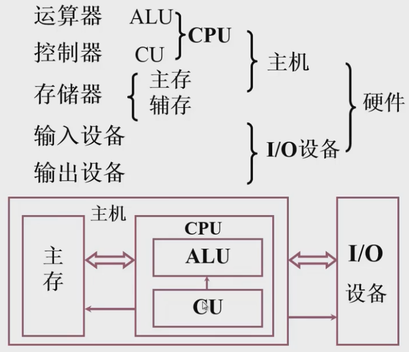
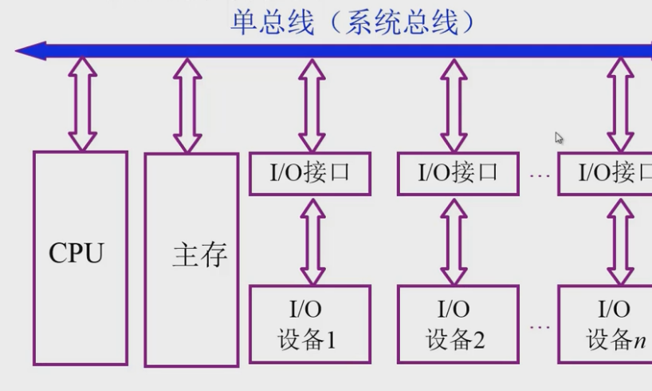
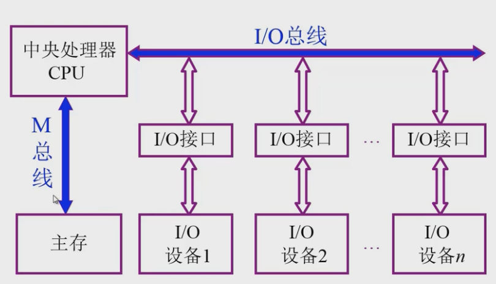
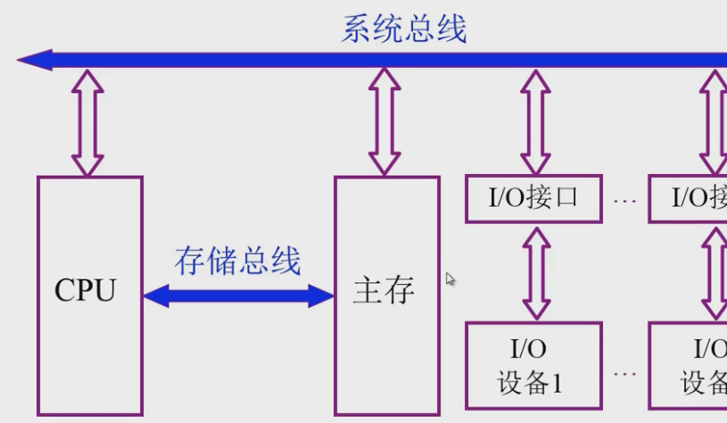

## 计算机组成原理
内容：  
基本部件的结构和组织方式  
基本运算的操作原理  
基本不见和单元的设计思想  

计算机基础 操作系统 编译原理  
数据结构 存储管理、调度、并发 代码生成优化  
计算机系统结构  
**计算机组成原理**  
基本逻辑单元(处理器基本知识)  
数字逻辑  

计算机硬件结构：存储器、I/O、系统总线、CPU

### 计算机系统简介
计算机系统：  
  * 硬件：实体(主机、外设)
  * 软件：由程序组成
    * 系统软件：用来管理整个计算机系统
    * 应用软件：按照任务编成的各种程序
### 计算机系统的层次结构
高级语言  
汇编语言  
操作系统  
机器语言  
微指令系统  

### 计算机的基本组成
1. 冯诺依曼计算机 存储程序结构的计算机  
五个部件组成  

指令和数据以同等地位存放在存储器中，可以按照地址寻址  
指令和数据用二进制表示  
指令由**操作码和地址码**组成  
存储程序  
以运算器为中心  

存在问题：  
运算器是系统的瓶颈 -> 以存储器为核心  
层次化划分  

系统复杂性管理：  
层次化(hierachy) 将被设计的系统划分为多个子模块  
模块化(modularity) 有明确定义的功能和接口  
规则性(regularity) 模块更容易被重用  

指令 -> 操作码 + 地址码  

#### 存储器的组成  
存储体：(大楼)  
存储单元：存放二进制代码(房间)  
存储字：存储单元的二进制代码组合(一个房间多个人)  
存储字长：存储单元中二进制代码的位数 每个存储单元存储一个地址  
存储单元按地址寻址  

MAR MDR  
MAR(存储器地址寄存器) 反映存储单元的个数(房间个数)  
MDR(存储器数据寄存器) 反映存储字长(房间中的人顺序)  

#### 运算器组成
ACC(寄存器)输入+输出 <- MQ(乘法操作增加位数)  
ALU(算术逻辑单元)  
X(寄存器)输入  

|     | ACC      | MQ(乘商寄存器)| X |
| --- | ---      | ---         | --- |
| 加法 | 被加数 和 |             |加数 |
| 减法 | 被减数 差 |             |  减数|
| 乘法 | 乘机高位  | 乘积地低位 乘数| 被乘数
| 除法 | 被除数    | 商          | 除数|

#### 控制器功能
解释指令  
保证指令按顺序执行  

取指令: PC(程序计数器：存放当前执行指令的地址，有计数功能)  
分析指令: IR(指令寄存器) 存放执行的指令  
执行指令: CU(控制信号)  

指令的完成过程  
程序执行过程  

#### 计算机硬件技术指标
机器字长：CPU一次能处理数据的位数，与CPU中的寄存器位数有关  
运算速度：主频 核数(每个核支持的线程数)  
CPI：执行一条指令所需要的时钟周期数  
MIPS：每秒执行百万条指令  
FLOPS：每秒浮点运算次数  
存储容量：
* 主存容量 存储单元个数(MAR) * 存储字长(MDR) 字节数  
* 辅存容量 

### 总线
#### 总线的概念
为什么要使用总线？方便扩展  
总线是连接各个部件的信息传输线，是各个部件共享的传输介质  
总线上的信息传送：串行 并行(短距离之间)  

* 单总线

任意时刻只能两两通信(总线被占用)
* 双总线

io和主存之间只能通过中央处理器进行通信(CPU任务会被打断)  

#### 总线的分类
* 位置 
  * 片内总线(芯片内部的总线)
  * 系统总线(计算机个部件之间的信息传输线))
    * 数据总线 双向 与机器字长、存储字长有关
    * 地址总线 单向 与存储地址、io地址有关
    * 控制总线 双向 传输控制信号
  * 通信总线(计算机系统之间通信)
    * 串行通信总线
    * 并行通信总线
#### 总线的特性和性能指标
p18

