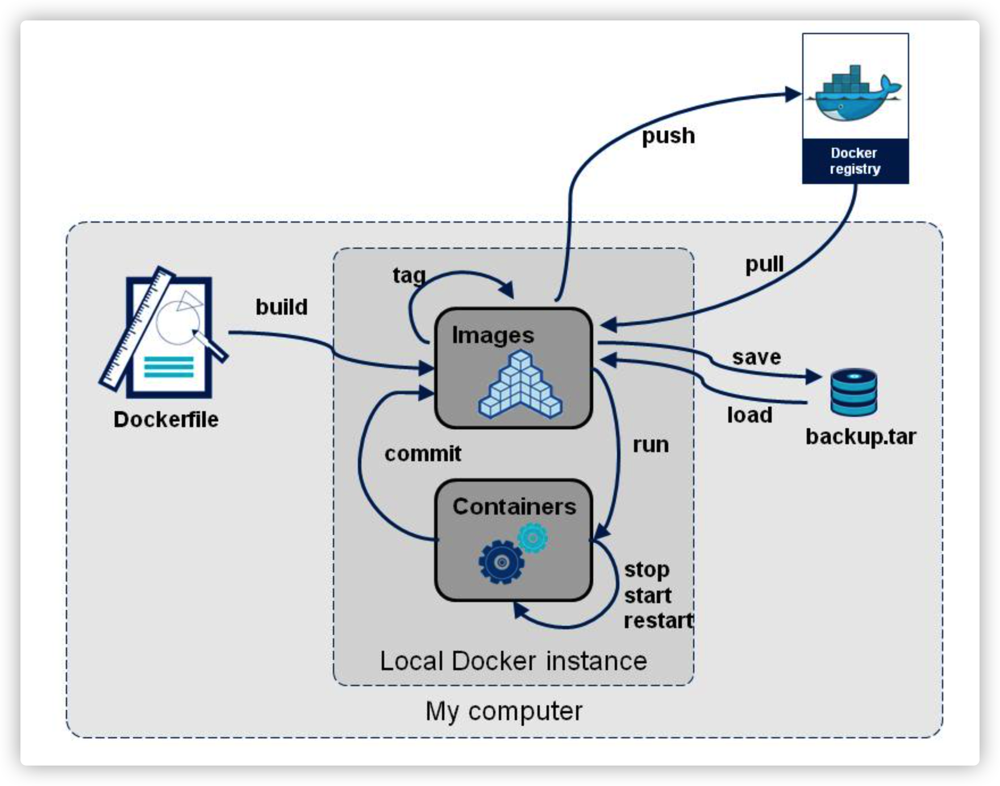

# Docker

http://www.docker.com/

https://hub.docker.com/

## 内容



出现原因


作用


## 常用命令

```
docker version
docker info
docker 命令 --helper

https://docs.docker.com/reference/
```

**容器 = 镜像 + 读写层**

一个运行态容器（running container）被定义为一个可读写的统一文件系统加上隔离的进程空间和包含其中的进程。正是文件系统隔离技术使得Docker成为了一个前途无量的技术。一个容器中的进程可能会对文件进行修改、删除、创建，这些改变都将作用于可读写层（read-write layer）。


为了将零星的数据整合起来，提出了镜像层（image layer）这个概念。一个层并不仅仅包含文件系统的改变，它还能包含了其他重要信息。

元数据（metadata）就是关于这个层的额外信息，它不仅能够让Docker获取运行和构建时的信息，还包括父层的层次信息。需要注意，只读层和读写层都包含元数据。每一层都包括了一个指向父层的指针。如果一个层没有这个指针，说明它处于最底层。

docker create 命令为指定的镜像（image）添加了一个可读写层，构成了一个新的容器。

docker start命令为容器文件系统创建了一个进程隔离空间。注意，每一个容器只能够有一个进程隔离空间。

docker run 命令先是利用镜像创建了一个容器，然后运行这个容器

（docker run就是docker create和docker start两个命令的组合）

docker ps 命令会列出所有运行中的容器。这隐藏了非运行态容器的存在，如果想要找出这些容器，我们需要使用docker ps -a

镜像命令

```shell
查找当前镜像
docker image
-q 只显示id

(base) qgs@192 ~ % docker images
REPOSITORY    TAG       IMAGE ID       CREATED        SIZE
alpine/git    latest    4ee6a3b79e0c   10 days ago    27.1MB
hello-world   latest    18e5af790473   2 months ago   9.14kB

搜索镜像
docker search mysql --filter=STARS=1000

下载镜像
docker pull mysql
docker pull docker.io/mysql/mysql-server:latest(真实地址)
默认是 latest
分层(layer)下载(联合文件系统)

删除镜像
根据id删除
docker rmi -f 镜像id
全部删除
docker rmi -f $(docker images -aq)
```

容器命令

```shell
有了镜像才可以下载容器

新建容器并启动
docker run -parameter image
--name="a name" 容器名字
-d 							后台运行
-it							以交互方式运行，进入容器查看内容
-p							指定容器端口
		-p ip:主机端口:容器端口
		-p 主机端口:容器端口
		-p 容器端口
		容器端口
-P							随机指定端口

启动并进入容器
(base) qgs@192 ~ % docker run -it centos /bin/bash
[root@264704b66e0a /]# 
[root@264704b66e0a /]# exit

exit 停止容器并退出
control + p + q 容器不停止退出

列出运行容器
docker ps      正在运行的容器
				  -a   现在 + 曾经 运行的容器
				  -n=1 最近创建的容器
				  -q   显示容器编号
				  
删除容器
docker rm 容器id
docker rm -f $(docker ps -aq) # 删除所有容器两种方式
docker ps -a -q | xargs docker rm
```


```shell
docker start 容器id
docker restart 容器id
docker stop 容器id # 停止正在运行的容器
docker kill 容器id
```

## 其他命令

```shell
后台启动容器
docker run -d centos # 返回容器id(无法启动)
容器后台运行必须有一个前台经常，否则会自动停止

日志
docker logs -f -t -tail 容器id
-tf # 显示日志
--tail number # 显示日志条数

查看进程
docker top 容器id

查看进行元数据
docker inspect 容器id # 容器详细数据

进入正在运行的容器
docker exec -it 容器id /bin/bash # 进入容器后开启一个新的终端
docker attch 容器id # 当前正在执行的终端，不启动新进程

从容器中复制文件到主机
docker cp 容器id:容器内路径 目的主机路径
docker cp 547f398cb41d:/home/cpfile.txt /Users/qgs/Desktop # 复制文件到桌面

```


```shell
部署nginx

docker search nginx
docker pull ngins:1.20.0
docker run -d --name nginx-1 -p 8765:80 nginx # 将本机的8765端口映射到docker的80端口
	-d 后台运行
	--name 起名
	-p 映射端口
	
	
部署tomcat
docker run -it -rm tomcat 
  --rm 运行完就删除
  
docker run -d -p 8081:8080 --name tomcat-01 tomcat # 映射本机的8081端口到docker的8080端口
docker exec -it tomcat-01 /bin/bash

部署 elasticsearch
docker run -d --name elasticsearch -p 9200:9200 -p 9300:9300 -e "discovery.type=single-node" -e ES_JAVA_OPTS="-Xms64m -Xmx512m" elasticsearch:7.6.2
curl localhost:9200

docker stats # 查看docker的内存使用情况
```


## 可视化

portainer 图形化界面管理工具

```shell
docker run -d -p 9000:9000 --restart=always -v /var/run/docker.sock:/var/run/docker.sock --privileged=true portainer/portainer
```


```shell
提交容器

docker commmit -m="描述信息" -a="作者" 容器id 目标镜像名:tag

docker commit -m="tomcat加上webapp" -a="qgs" ea5d910ec335 tomcat-webapps:1.0
docker run -d -p 8080:8080 --name tomcat01 tomcat-webapps:1.0
```


## 容器数据卷

一种同步机制(将数据持久化)

```shell
docker run -it -v 主机目录:容器目录

docker run -it -v /Users/qgs/Desktop/docker:/usr/local/tomcat/webapps -p 8080:8080 tomcat-webapps:1.0 /bin/bash


docker run -it -v /Users/qgs/Desktop/centos:/home centos /bin/bash

docker start 6798ad5a0ba1 
docker attach 6798ad5a0ba1


docker run -d -p 3306:3306 -v /Users/qgs/Desktop/docker/mysql/conf:/ect/mysql/conf.d -v /Users/qgs/Desktop/docker/mysql/data:/var/lib/mysql -e MYSQL_ROOT_PASSWORD=root mysql/mysql-server
-d 后台运行
-p 端口映射
-v 卷挂载
-e 环境配置
--name 别名

# 开启后需要创建用户然后授权，否则无法登录
docker exec -it mysql /bin/bash
mysql -uroot -p
create user 'root'@'%' identified by 'root';
grant all privileges on *.* to 'root'@'%';
```


具名挂载，匿名挂载

```shell
匿名挂载
-v 不提供本地地址


具名挂载
-v 后面提供名字，不提供目录
docker run -d -P --name nginx-1 -v name-nginx:/etc/nginx nginx

docker volume ls # 列出所有的卷
docker volume inspect mysql/mysql-server # 查看挂载信息

区分两者：
-v 容器内路径 # 匿名
-v 卷名:容器内路径 # 具名
-v /主机地址:容器内路径 # 指定路径挂载


docker run -d -P --name nginx-1 -v name-nginx:/etc/nginx:ro nginx
ro: 只能通过宿主机操作，容器内不能修改
rw: 读写
```


## Dockerfile

docker镜像的构建文件

```shell
# 构建文件内容(全大写)
FROM centos
VOLUME ["volume01", "volume02"] # 匿名挂载卷，容器内的路径
CMD echo "end..."
CMD /bin/bash

# 构建
docker build -f /构建文件地址 -t my-centos . # 当前目录

# 发布镜像
docker push
```


```shell
# dockerfile指令

from          # 基础镜像
maintainer    # 维护者信息
run           # 构建的时候运行的命令
add           # 加一下文件
workdir       # 工作目录
volume        # 挂载目录
expost        # 暴露端口
cmd           # 启动容器时执行的命令；如果指定了多条命令，只有最后一条会被执行。
entrypoint    # 追加
onbuild       # 配置当所创建的镜像作为其它新创建镜像的基础镜像时，所执行的操作指令。
copy          # 复制本地主机的 <src>（为 Dockerfile 所在目录的相对路径）到容器中的 <dest>
env           # 环境变量，会被后续 RUN 指令使用，并在容器运行时保持。


cmd & entrypoint # 区别
# --- 一个镜像
FROM centos
CMD ["ls", "-a"]
ENTRYPOINT ["ls", "-a"]

# --- 运行
docker run centos-ls -l # 如果是 cmd 会报错，如果是 entrypoint 真正执行的是 ls -al
```

```shell
# 构建一个centos

FROM scratch
ADD centos-7-x86_64-docker.tar.xz /

LABEL \
    org.label-schema.schema-version="1.0" \
    org.label-schema.name="CentOS Base Image" \
    org.label-schema.vendor="CentOS" \
    org.label-schema.license="GPLv2" \
    org.label-schema.build-date="20201113" \
    org.opencontainers.image.title="CentOS Base Image" \
    org.opencontainers.image.vendor="CentOS" \
    org.opencontainers.image.licenses="GPL-2.0-only" \
    org.opencontainers.image.created="2020-11-13 00:00:00+00:00"

CMD ["/bin/bash"]

# --------------
FROM centos
MAINTAINER qgs

ENV MYPATH /usr/local    # 配置一些环境变量
WORKDIR $MYPATH          # 使用上面的变量

RUN yum -y install vim
RUN yum -y install net-tools

EXPOSE 80

CMD echo $MYPATH
CMD echo "end..."
CMD /bin/bash

# ------------
docker build -f dockerfile.txt -t centos-vim .
```


## 数据卷容器

容器间进行数据共享(配置文件，数据文件)

```shell
docker run -it --name centos01 e2b8b2bb810d
control + p + q # 后台运行
docker run -it --name centos02 --volumes-from centos01  e2b8b2bb810d          
docker run -it --name centos03 --volumes-from centos01  e2b8b2bb810d 

--volumes-from 容器间数据共享

docker rm -f centos01 # 删除01之后其他还在
```

```shell
# 多个mysql数据共享

docker run -d -p 3306:3306 -v /ect/mysql/conf.d -v /var/lib/mysql -e MYSQL_ROOT_PASSWORD=root --name mysql01 mysql/mysql-server # 先启动一个

docker run -d -p 3307:3306 -e MYSQL_ROOT_PASSWORD=root --name mysql02 --volumes-from mysql01 # 启动另一个
```

```shell
# tomcat 镜像

FROM centos
MAINTAINER qgs

COPY readme.md /usr/local/readme.md

ADD jdk-11.0.13_linux-x64_bin.tar.gz /usr/local/
ADD apache-tomcat-8.5.73.tar.gz /usr/local/

RUN yum -y install vim
RUN yum -y install glibc.i686

ENV MYPATH /usr/local
WORKDIR $MYPATH

ENV JAVA_HOME /usr/local/jdk-11.0.13

ENV CATALINA_HOME /usr/local/apache-tomcat-8.5.73
ENV CATALINA_BASH /usr/local/apache-tomcat-8.5.73

ENV PATH $PATH;$JAVA_HOME/bin;$CATALINA_HOME/lib;$CATALINA_HOME/bin     

EXPOSE 8080

CMD /usr/local/apache-tomcat-8.5.73/bin/startup.sh && tail -F /usr/local/apache-tomcat-8.5.73/bin/logs/catalina.out

# 构建

# 运行

docker run -d -p 8080:8080 --name centos-java-tomcat -v /Users/qgs/Desktop/docker/tomcat/webapps:/usr/local/apache-tomcat-8.5.73/webapps -v /Users/qgs/Desktop/docker/tomcat/logs:/usr/local/apache-tomcat-8.5.73/logs centos-java-tomcat
```


## 发布镜像到 dockerhub

```shell
# 登录
docker login -u qinguishuang
dockerHm587833

# 添加一个tag
docker tag 镜像id tag:1.0
# 发布
docker push 镜像id
```


## 发布镜像到aliyun

```shell
https://cr.console.aliyun.com/cn-hangzhou/instances
https://cr.console.aliyun.com/cn-hangzhou/instance/repositories
```


## docker网络

```shell
docker run -p 8080:8080 --name tomcat01 -d qinguishuang/tomcat-webapps:1.0

# 每启动一个容器，docker会给容器分配一个ip，同时多一对网卡
# 安装docker之后，会有一个网卡 docker0(类似于一个路由器)
# 通过桥接模式 evth-pair：一对虚拟设备接口，作为桥梁连接虚拟网络设置
# 容器之间可以 ping通

# 容器互联(通过容器名互相访问)
docker run -p 8080:8080 --name tomcat01 -d qinguishuang/tomcat-webapps:1.0
docker run -p 8081:8080 --name tomcat02 -d qinguishuang/tomcat-webapps:1.0
docker exec -it tomcat01 ping tomcat02 

docker run -p 8082:8080 --name tomcat02 --link tomcat03 -d qinguishuang/tomcat-webapps:1.0 # /ect/hosts 里面写死了 tomcat02 的ip地址 和 容器id
```


## 自定义网络

```shell
网络模式

bridge    : 桥接
none      : 不配置网络
host      : 和宿主机共享网络
container : 容器内网络联通

docker run -d -p 8080:8080 --name tomcat01 --net bridge tomcat

# 自定义网络
docker network create --driver bridge --subnet 192.168.0.0/16 --gateway 192.168.0.1 mynet
docker network ls

docker network inspect mynet

# 将自己的服务放到自定义网络中
docker run -d -p 8080:8080 --name tomcat-net-01 --net mynet tomcat # -P 随机端口

# 自定义网络可以通过名称进行 ping
# 自动维护对应关系
```


容器和网络连通

```shell
docker network connect mynet tomcat01
# 一个容器，两个ip
```


## 部署 springboot

dockerfile 编写

```shell
FROM java:8
EXPOSE 8080

VOLUME /tmp
ENV TZ=Asian/Shanghai
RUN ln -sf /usr/share/zoneinfo/${TZ} /etc/localtime && echo "${TZ}" > /etc/timezone

# 把 jar 包复制到容器
ADD spring-boot-example.jar /spring-boot-example.jar
RUN bash -c 'touch /spring-boot-example.jar'
ENTRYPOINT ["java", "-jar", "spring-boot-example.jar"]
```


```shell
# 启动


docker run -p 6379:6379 -d --name="redis" redis

# 给 redis 起别名，在 springboot 的配置文件中不能写 localhost
docker run -p 8080:8080 --name example --link redis:myRedis --platform linux/amd64 -d spring-boot-example
```


## docker-compose

- 服务 service
- 工程 project


服务保证先后顺序，服务故障重启后 ip 可能会改变

```sh
docker run -d -p 6001:6001 -v /local:/docker --network a_network --name a-service a-service:1.0
```


代码中连接 mysql 时 `jdbc:mysql://mysql:3306/service`  不固定 host

```sh
docker-compose config -q # 测试 yml 语法
docker-compose up -d # 启动
```


```yaml
version: "3.8"

services:
  microService:
    image: a-service:1.0
    container_name: a-service
    ports:
      - "6001:6001"
    volumes:
      - /local:/docker
    networks:
      - a-network
    depends_on:
      - redis
      - mysql

  redis:
    image: redis
    ports:
      - "6379:6379"
    volumes:
      - /qgs/redis.conf:/etc/redis/redis.conf
      - /qgs/data:/data
    networks:
      - a-network
    command: redis-server /etc/redis/redis.conf

  mysql:
    image: mysql:5.7
    environment:
      MYSQL_ROOT_PASSWORD: 'root'
      MYSQL_ALLOW_EMPTY_PASSWORD: 'no'
      MYSQL_DATABASE: 'service'
      MYSQL_USER: 'root'
      MYSQL_PASSWORD: "root"
    ports:
      - "3306:3306"
    volumes:
      - /qgs/db:/var/lib/mysql
      - /qgs/my.conf:/etc/my.cnf
      - /qgs/init:/docker-entrypoint-initdb.d
    networks:
      - a-network
    command: --default-authentication-plugin=mysql_native_password

networks:
  a-network:

```


# Kubernetes


## 组件

[参考](https://kubernetes.io/zh-cn/docs/concepts/overview/components/)


- 控制平面组件 (control plane component)
  - kube-apiserver
  - etcd
  - kube-scheduler
  - kube-controller-manager
  - cloud-controller-manager
- Node 组件
  - kubelet
  - kube-proxy
  - 容器运行时


service 作为访问入口，由 controller 创建 pod 进行部署

- Pod

  - 最小部署单元

  - 一组容器集合

    一个 docker 对应一个容器，一个 pod 有多个容器，一个容器里面运行一个应用程序

  - 共享网络

  - 生命周期短暂

- controller

  - 确保 pod 副本数量
  - 有/无 状态应用部署
  - 一次性任务 和 定时任务

- service

  - 定义一组 pod 访问规则


## kubectl 命令

```sh
kubectl [command] [TYPE] [NAME] [flags]
kubectl [command] [type] [name1 name2] [flags]
kubectl [command] [type/name] [type/name] [flags]

kubectl get pod nginx tomcat
kubectl get pod/nginx pod/tomcat


command: create/get/describe/delete
type: 资源类型 (pod)
name: 资源名称
flags: 可选参数，-s --server 指定 kubernetes api 服务器的地址和端口
```

```sh
# 创建服务 暴露服务
kubectl create deployment nginx --image=nginx
kubectl expose deployment nginx --port=80 --type=NodePort
```


`kubectl api-resources`

没有 yml 文件的情况下杀出 pod 

```sh
kubectl get deploy
kubectl delete deploy xxx
```


yml 文件生成

- `kubectl create deployment nginx-80 --image=nginx -o yaml --dry-run=none > nginx.yml`
- `kubectl get deploy nginx-80 -o=yaml --export > nginx.yaml`

```yaml
apiVersion: apps/v1
kind: Deployment
metadata:
  name: nginx-deployment
spec:
  selector:
    matchLabels:
      app: nginx
  replicas: 2 # 告知 Deployment 运行 2 个与该模板匹配的 Pod
  template:
    metadata:
      labels:
        app: nginx
    spec:
      containers:
      - name: nginx
        image: nginx:1.14.2
        ports:
        - containerPort: 80
```


## 拉取策略

```yaml
apiVersion: v1
kind: Pod
metadata:
  name: nginx
spec:
  containers:
    - name: nginx
      image: nginx:1.21.0
      imagePullPolicy: Always / IfNotPresent / Never

```


## 资源限制

```yaml
apiVersion: v1
kind: Pod
metadata:
  name: mysql
spec:
  containers:
    - name: db
      image: mysql:5.7
      env:
        - name: MYSQL_ROOT_PASSWORD
          value: "root"
      resources:
        requests: # 预估申请
          memory: "1024Mi"
          cpu: "256m"
        limits: # 最大限额
          memory: "4096Mi"
          cpu: "1024m"
```


## 重启机制

```yaml
apiVersion: v1
kind: Pod
metadata:
  name: nginx
spec:
  containers:
    - name: nginx
      image: nginx:1.21.0
      imagePullPolicy: Always
  restartPolicy: Always(每次都重启) / OnFailure(异常退出才重启) / Never(不重启)
```


## 健康检查

- 存活检查：检查失败，杀掉容器然后根据 restartPolicy 决定是否重启
- 就绪检查：检查失败把 pod 从 service endpoints 中剔除

检查方法

- httpGet：返回 200 - 400 为成功
- exec：执行 shell 命令返回状态码为 0 则成功
- tcpSocket：发起 tcp ，socket 建立成功

```yaml
apiVersion: v1
kind: Pod
metadata:
  name: nginx
spec:
  containers:
    - name: nginx
      image: nginx:1.21.0
      imagePullPolicy: Always
      args:
        - /bin/bash
        - -c
        - touch /tmp/health; sleep 30; rm -rf /tmp/health
      livenessProbe:
        exec:
          command:
            - cat
            - /tmp/health
        initialDelaySeconds: 5 # 在容器启动后，延时多少秒才开始探测
        periodSeconds: 5
  restartPolicy: Always

```


## 调度策略


**标签** (nodeSelector)

```sh
kubectl label nodes <your-node-name> disktype=ssd
kubectl label nodes <your-node-name> disktype-

kubectl get nodes --show-labels
```


**亲和性 **(affinity)

```yaml
apiVersion: v1
kind: Pod
metadata:
  name: nginx
spec:
  affinity:
    nodeAffinity:
      requiredDuringSchedulingIgnoredDuringExecution:
        nodeSelectorTerms:
          - matchExpressions:
              - key: env_roles
                operator: In
                values:
                  - dev
                  - test
      preferredDuringSchedulingIgnoredDuringExecution:
        - preference:
            matchExpressions:
              - key: group
                operator: In
                values:
                  - other
          weight: 1
  containers:
    - name: nginx
      image: nginx:1.21.0
      imagePullPolicy: Always

```


**污点 和 容忍度**

pod 配置容忍度，node 配置污点

用来避免 Pod 被分配到不合适的节点上

```sh
# 添加/删除 污点
kubectl taint nodes node1 key1=value1:NoSchedule
kubectl taint nodes node1 key1:NoSchedule-
```

- NoSchedule：一定不被调度
- PreferNoSchedule：尽量不被调度
- NoExecute：不会调度且驱逐当前 node 已有 pod

```yaml
apiVersion: v1
kind: Pod
metadata:
  name: nginx
spec:
  tolerations:
    - key: "k1"
      operator: "Equal"
      value: "v1"
      effect: "NoSchedule"
  containers:
    - name: nginx
      image: nginx:1.21.0
      imagePullPolicy: Always
```


## Controller

在集群上管理和运行容器的对象

- 确保 pod 副本数量
- pod 通过 controller 实现应用的运维 (伸缩，升级)
- pod 和 controller 之间通过 label 建立关系 (selector)


**deployment**

- 无状态应用
- 管理 pod 和 ReplicaSet
- 部署，滚动升级

```yaml
apiVersion: apps/v1
kind: Deployment
metadata:
  name: nginx
spec:
  replicas: 1
  selector:
    matchLabels:
      app: nginx
  template:
    metadata:
      labels:
        app: nginx
    spec:
      containers:
        - name: nginx
          image: nginx:1.21.0
          imagePullPolicy: Always

```

`kubectl expose deployment nginx --port=80 --type=NodePort --target-port=80 --name=nginx -o yaml > nginx-nodeport.yml`


`kubectl set image deployment nginx nginx=nginx:1.21.1 `

`kubectl rollout status deployment nginx `

`kubectl rollout history deployment nginx`

`kubectl rollout undo deployment nginx`

`kubectl rollout undo deployment nginx --to-revision=1`

`kubectl scale deployment nginx --replicas=3`


**StatefulSet**

`主机名.service名称.命名空间.svc.cluster.local`


**DaemonSet**

在每个 node 上运行一个 pod，


**Job**

**CronJob**


## Service

定义一组 pod 的访问规则

- 防止 pod 失联 (服务发现)
- 定义一组 pod 访问策略 (负载均衡)
- pod 和 service 使用 label 和 selector 建立关联


三种类型

- ClusterIP：集群内部访问
- NodePort：对外暴露
- LoadBalancer：云服务外部访问


## 配置管理

- Secret

  - 创建加密数据

    ```yaml
    apiVersion: v1
    kind: Secret
    metadata:
      name: a-secret
    data:
      username: cm9vdA==
      password: cm9vdA==
    ```

  - 以变量的形式挂载到 pod 中

    进入容器可以查看 `echo $secret_username`

    ```yaml
    apiVersion: apps/v1
    kind: Deployment
    metadata:
      name: nginx
    spec:
      replicas: 1
      selector:
        matchLabels:
          app: nginx
      template:
        metadata:
          labels:
            app: nginx
        spec:
          containers:
            - name: nginx
              image: nginx:1.21.0
              imagePullPolicy: Always
              env:
                - name: secret_username
                  valueFrom:
                    secretKeyRef:
                      name: a-secret
                      key: username
                - name: secret_password
                  valueFrom:
                    secretKeyRef:
                      key: password
                      name: a-secret
    ```

  - 以 volume 的形式挂载 pod 容器

    进入容器后 /etc/nginx 目录下会有两个文件 username, password

    ```yaml
    apiVersion: apps/v1
    kind: Deployment
    metadata:
      name: nginx
    spec:
      replicas: 1
      selector:
        matchLabels:
          app: nginx
      template:
        metadata:
          labels:
            app: nginx
        spec:
          containers:
            - name: nginx
              image: nginx:1.21.0
              imagePullPolicy: Always
              volumeMounts:
                - mountPath: /etc/nginx
                  name: foo
                  readOnly: false
          volumes:
            - name: foo
              secret:
                secretName: a-secret
    ```

    

- ConfigMap

  创建

  ```yaml
  
  ```

  ```sh
  # 从 properties 文件创建 ConfigMap
  kubectl create configmap spring-boot-cm --from-file=application.properties
  ```

  - 以 volume 挂载到 pod

    ```yaml
    apiVersion: v1
    kind: Pod
    metadata:
      name: nginx
    spec:
      containers:
        - name: nginx
          image: nginx:1.21.0
          command: ['/bin/sh', '-c', 'cat /etc/config/application.properties']
          volumeMounts:
            - mountPath: /ect/config
              name: application-config
      volumes:
        - name: springboot-cm
          configMap:
            name: springboot-cm
    ```

  - 以变量的形式挂载到 pod


## 安全机制

认证，授权，准入控制


命名空间

```yaml
kubectl get ns
# 创建命名空间
kubectl create ns qgs
# 指定命名空间创建 pod
kubectl run nginx --image=nginx:1.20.0 -n qgs
```


创建角色

```yaml
apiVersion: rbac.authorization.k8s.io/v1
kind: Role
metadata:
  name: nginx
  namespace: qgs
rules:
  - apiGroups:
      -
    resources:
      - pods
    verbs:
      - get
      - watch
      - list
```


创建角色绑定

```yaml
kind: RoleBinding
apiVersion: rbac.authorization.k8s.io/v1
metadata:
  name: read-pods
  namespace: qgs
subjects:
  - kind: User
    name: qqq
roleRef:
  apiGroup: rbac.authorization.k8s.io
  kind: Role
  name: pod-reader
```


使用证书识别身份


## Ingress


pod 和 ingress 通过 service 关联

ingress 作为统一入口，由 service 关联一种 pod


部署 ingress controller

创建 ingress 规则

```yaml
# 创建 nginx 向外暴露
kubectl create deployment nginx --image=nginx:1.20.0
kubectl expose deployment nginx --port=80 --target-port=80 --type=NodePort
# 

```


## Helm

包管理工具

1. 将 yaml 文件作为一个整体关联

2. 实现 yaml 的复用

3. 应用级别的版本管理


- Helm：命令行客户端工具
- Chart：yaml 集合
- Release：基于 chart 部署实体，应用级别的版本管理


```sh
helm add repo stable http://mirror.kaiyuanshe.cn/kubernetes/charts/
helm repo list

helm search repo tomcat
helm install tomcat-7 stable/tomcat
helm uninstall tomcat-7
helm list
helm status tomcat-7

kubectl get svc
kubectl edit svc tomcat-7
```


自己创建 Chart

```sh
helm create my-tomcat
```

Chart.yaml：当前 chart 属性配置信息

templates：自己的 yaml

value.yaml：全局变量

```sh
kubectl create deployment my-nginx --image=nginx --dry-run=client -o yaml > my-nginx.yaml
kubectl expose deployment my-nginx --port=80 --target-port=80 --type=NodePort --dry-run=client -o yaml > my-service.yaml


helm install my-nginx
helm upgrade my-nginx
```


## 持久化存储


- nfs 网络存储
- pv 和 pvc
  - pv：对存储资源进行抽象，对外提供可以调用的地方 (运维处理)
  - pvc：用于调用，不关心内部细节 (自己提供)


