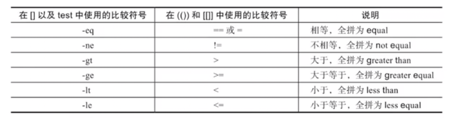
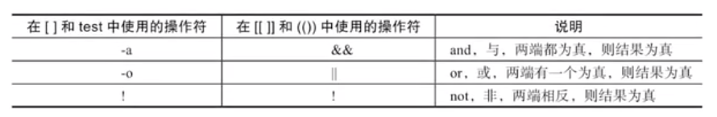
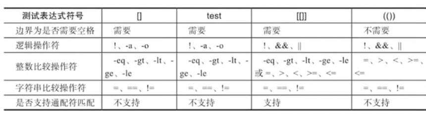

# Linux 命令


## cat

编辑文件

```sh
# 将输入输出到文件，以 EOF 结尾
cat > hello.txt << EOF
# -n 输出行号
```


## echo

```sh
# 将内容显示到命令行
echo hello
echo 'hello'
echo -e 'hello\tworld' # 识别特殊字符
echo 'hello' > hello.txt # 清空原来的，然后添加
echo 'world' >> hello.txt # 追加到末尾
```


## grep

过滤

```sh
grep option pattern file
# -v 显示不匹配的行
# -n 显示行号
# -i 不区分大小写
# -c 只统计匹配的行数，不是匹配的次数
# -w 以单词为单位进行过滤
# -o 只输出匹配的内容
# -E 支持正则

grep -nE 'o|O' hello.txt # 查找包含 o 或 O 的行，并显示行号
```


## sed

流编辑器

```sh
sed [选项] [sed 内置命令] [文件]

# -n 取消默认 sed 的输出
# -i 直接修改文件 (in-place)
# -e 允许多次编辑

# a 追加
# d 删除
# i 插入
# p 打印
# s/regexp/replacement/g 替换 (g 全局)

sed -n '2,3p' hello.txt # 输出 2-3 行内容
sed -n '/o/p' hello.txt # 输出包含 o 的行
sed -n '/o/d' hello.txt

sed -i '5,8d' hello.txt # 删除文件中的 5-8 行

sed 's/o/O/g' hello.txt # 将 o 替换成 O
# -i 在 mac 环境下会报错
# sed: 1: "hello.txt": extra characters at the end of h command
# sed -i '' 's/o/O/g' hello.txt
sed -i 's/o/O/g' hello.txt # 将 o 替换成 O，文件也会被修改

sed -e 's/0/O/g' -e's/a/A/g' hello.txt # 多次替换

sed -i '2a hi' hello.txt # 第 2 行后添加字符
sed -i '2i hi' hello.txt # 替换第 2 行的内容

```


```sh
# 获取 ip
en0: flags=8863<UP,BROADCAST,SMART,RUNNING,SIMPLEX,MULTICAST> mtu 1500
	options=6463<RXCSUM,TXCSUM,TSO4,TSO6,CHANNEL_IO,PARTIAL_CSUM,ZEROINVERT_CSUM>
	ether 50:ed:3c:45:b9:a4
	inet6 fe80::a5:8e85:7df8:5364%en0 prefixlen 64 secured scopeid 0xb
	inet 192.168.0.198 netmask 0xffffff00 broadcast 192.168.0.255
	nd6 options=201<PERFORMNUD,DAD>
	media: autoselect
	status: active

# 获取 ip
# 获取第 2 行 -> 将 ip 前面的字符替换掉 -> 将 ip 后面的字符替换掉
ifconfig en0 | sed -n '5s/^.*inet //gp' | sed -n 's/netm.*$//gp'
ifconfig en0 | sed -ne '5s/^.*inet //g' -ne 's/netm.*$//gp'
ifconfig en0 | sed -nr '5s/^.*inet (.*) netm.*$/\1/gp'


cat hello.txt | sed -rn 's/(hello) (world)/\1\2/gp'
```


## awk


```sh
awk [ooption] 'pattern{action}' file...
# -F 指定字段分隔符
# -v 定义或修改一个变量

# $0 当前行记录
# $n 当前记录的第 n 行
# NF 当前有多少列
# $(NF-n) 倒数 n+1 列
# NR 已经读出的记录数 (行号)

# 读取内容
awk 'NR==2' hello.txt
awk 'NR>1 && NR<4' hello.txt

# 过滤
awk '/root/' hello.txt # 包含 root 的行
awk '/^\d/' hello.txt # 以数字开头的行

# 指定分隔符进行分割
awk -F ':' '{print NR, $1, $2, NF}' hello.txt

# 获取 ip
ifconfig en0 | awk 'NR==5{print $2}'

# 获取域名，按照次数排序
awk -F '/' '{print $3}' host.txt | sort | uniq -c
```


## cron

定时任务 (分钟为单位 (分时日月周))


crontab 定时任务编辑

```sh
# 分时日月周
* * * * *

# * 任意时间
# - 时间范围
# , 分隔时段 (枚举值)
# /n 每个 n 个时间单位

crontab -l
# -l 查看定时任务
# -e 编辑
# -i 删除 (删除前提示)
# -r 删除
# -u user 指定使用的用户执行任务

# 定期备份数据
00 00 * * * /bin/tar zcf /data/bak_${date +%F}.tar.gz /hello.txt
```


# Shell


## 运行

```sh
./sh.sh & # 后台运行，日志依然会输出
jobs # 查看后台任务
fg 1 # 将后台脚本放到前台
bg # 将程序放到后台
ctrl + c # 停止
ctrl + z # 放后台

# 动态查看结果
tail -f log.txt
```


## 变量

```sh
a=3
echo $a
echo ${a}-a # 加上括号可以继续拼接字符串
unset a

# 声明的变量无法在子环境中运行 (局部变量)
# export 声明环境变量 (全局变量)

env # 查看全局变量
set # 查看当前 shell 所有变量 (全局 + 局部)
```

初始化顺序

- /etc/profile
- ~/.bash_profile
- ~/.bashrc


```sh
a=hello-$a # 解析变量
b='hello-$a' # 原样输出
c="hello-$a" # 解析变量
```


```sh
# 获取命令结果
a=`pwd`
b = $(pwd)
```


特殊变量

```sh
echo $0 # 当前执行的 shell 脚本文件名
echo $n ${10} # 执行时携带的参数，
echo $# # 执行时携带的参数个数
echo $*
echo $@
echo $? # 上一条执行是否执行成功 (0-成功 1-失败)

dirname $0 # 获取脚本路径
basename $0 # 获取脚本名称

set -- hello hi world # 清除之前的变量，重写设置
echo "$*" # 将所有变量作为一个整体
echo "$@" # 所有变量是分开的
```


```sh
echo a # 标准输出
eval args # 读取参数，组合成新的命令然后执行

sh this.sh hello world
eval "echo \$$#"
```


## 运算

```sh
echo $((2 * 3))
i = $((2 + 1)) # 进行运算
echo ${i > 4}

# let expr 也可以
echo "3.2 1.6" | awk '{pring ($1-$2)}' # 小数运算
```


```sh
# 测试：如果文件存在，输出 exist，否则输出 not exist
test -f notExist.txt && echo 'exist' || echo 'not exist'
[ -f notExist.txt ] && echo 'exist' || echo 'not exist' # 前后加空格 -a -g -gt -lt
[[ -f notExist.txt ]] && echo 'exist' || echo 'not exist' # 可以使用 && || > < 等运算符

# 字符串比较
[ -n 'a' ] # 长度不为 0 true
[ -z 'a' ] # 长度为 0 true
[ 'a' = 'b' ] # 比较字符串
[ 'a' != 'b'] # 不能用 !== 
```








## 分支

```sh
if [ -f "$file_here" ]
  then
    echo 'here'
elif [ if "$file_oh" ]
  then
    echo 'oh'
else
    echo 'there'
fi
```


```sh
read [参数] [变量名]
# -p 提示信息(prompt)
# -t 等待时间 s (timeout)
read -p 'input two num' -t 10 a b
if [ $a -lt $b ]
  then echo "$a < $b"
elif [ $a -eq $b ]; then
    echo "$a = $b"
else
  echo "$a > $b"
fi
```


```sh
read -p 'input a num' num
case "$sum" in 
  1) echo "the num is 1";;
  2) echo "the num is 2";;
  [3-9]) echo "this num is between 3 and 9";;
  *) echo "don't know the num";;
esac
```


## 循环

```sh
while []
do
  echo ""
done


until []
do
  echo ""
done

for v in $@
do 
  echo "$v"
done

for(( i=0; i<10; i++ ))
do
  echo "${i}"
done
```


## 函数

```sh
# 声明函数，参数列表不需要定义参数
function add() {
	return $1 + $2
}

# 调用
add a b
echo $? # 获取函数返回的结果

# 加载其他文件中的函数
[ if ./functions.sh ] && . ./functions.sh || exit 1
```


## 案例

```sh
# 查看 mysql 是否运行 (wc 查看结果有几行)
if [ `netstat -an | grep mysql | wc -l` -gt 0 ]; then
  echo 'mysql is running'
else 
  echo 'mysql is stopped'
fi
```


