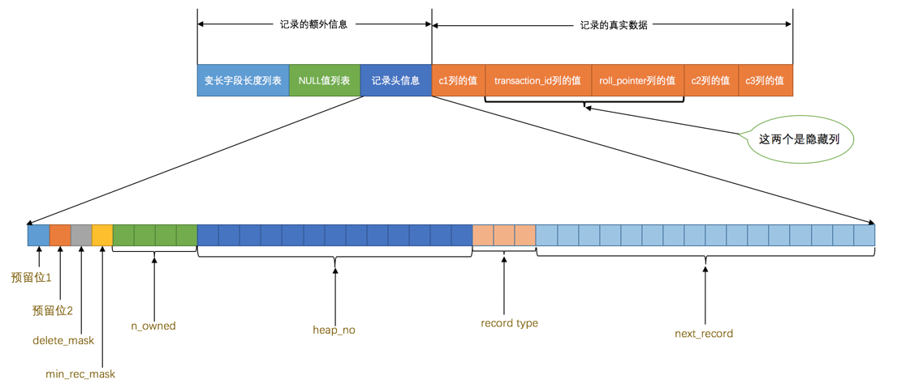
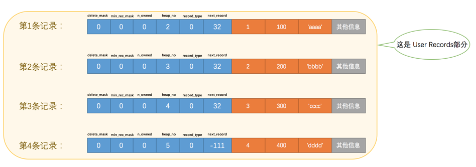
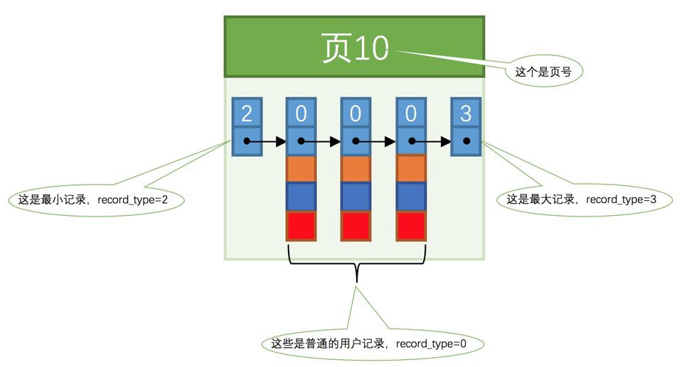

# Mysql是怎样运行的


## 2. 启动选项和系统变量

### 2.1 启动选项

短形式的选项名只有一个字母，与使用长形式选项时需要在选项名前加两个短划线`--`不同的是，使用短形式选项时在选项名前只加一个短划线`-`前缀。使用短形式指定启动选项时，选项名和选项值之间可以没有间隙，或者用空白字符隔开（`-p`选项有些特殊，`-p`和密码值之间不能有空白字符）

对于启动选项来说，如果启动选项名由多个单词组成，各个单词之间用短划线`-`或者下划线`_`连接起来都可以，但是对应的系统变量之间必须使用下划线`_`连接起来。


| 长形式       | 短形式 | 含义     |
| ------------ | ------ | -------- |
| `--host`     | `-h`   | 主机名   |
| `--user`     | `-u`   | 用户名   |
| `--password` | `-p`   | 密码     |
| `--port`     | `-P`   | 端口     |
| `--version`  | `-V`   | 版本信息 |


### 2.2 配置文件位置

Windows

| 路径名                                | 备注                                   |
| ------------------------------------- | -------------------------------------- |
| `%WINDIR%\my.ini`， `%WINDIR%\my.cnf` | `echo %WINDIR%`                        |
| `C:\my.ini`， `C:\my.cnf`             |                                        |
| `BASEDIR\my.ini`， `BASEDIR\my.cnf`   | `BASEDIR`指的是`MySQL`安装目录的路径   |
| `defaults-extra-file`                 | 命令行指定的额外配置文件路径           |
| `%APPDATA%\MySQL\.mylogin.cnf`        | 登录路径选项，不是纯文本（仅限客户端） |

Unix

| 路径名                | 备注                                             |
| --------------------- | ------------------------------------------------ |
| `/etc/my.cnf`         |                                                  |
| `/etc/mysql/my.cnf`   |                                                  |
| `SYSCONFDIR/my.cnf`   |                                                  |
| `$MYSQL_HOME/my.cnf`  | 特定于服务器的选项（仅限服务器）                 |
| `defaults-extra-file` | 命令行指定的额外配置文件路径                     |
| `~/.my.cnf`           | 用户特定选项                                     |
| `~/.mylogin.cnf`      | 用户特定的登录路径选项，不是纯文本（仅限客户端） |


### 2.3 配置文件内容


定义多个分组

```
[server]
option1            #这是option1，该选项不需要选项值
option2 = value2      #这是option2，该选项需要选项值
...

[mysqld]
(具体的启动选项...)

[client]
(具体的启动选项...)
```


命令启动时会按顺序读取其他分组的配置

| 启动命令       | 类别       | 能读取的组                               |
| -------------- | ---------- | ---------------------------------------- |
| `mysqld`       | 启动服务器 | `[mysqld]`、`[server]`                   |
| `mysqld_safe`  | 启动服务器 | `[mysqld]`、`[server]`、`[mysqld_safe]`  |
| `mysql.server` | 启动服务器 | `[mysqld]`、`[server]`、`[mysql.server]` |
| `mysql`        | 启动客户端 | `[mysql]`、`[client]`                    |
| `mysqladmin`   | 启动客户端 | `[mysqladmin]`、`[client]`               |
| `mysqldump`    | 启动客户端 | `[mysqldump]`、`[client]`                |


### 2.4 MySQL 系统变量

```sql
SHOW VARIABLES LIKE 'default_storage_engine';
```

可以动态修改而无需停止服务

系统变量的作用范围

- global：全局
- session：会话

不是所有系统变量都具有`GLOBAL`和`SESSION`的作用范围。有些系统变量是只读的(`version`)

```sql
SET GLOBAL default_storage_engine = MyISAM;
SET SESSION default_storage_engine = MyISAM;
```


### 2.5 状态变量

关于程序运行状态的变量，只能由服务器程序自己来设置；作用范围也是两种

(`Threads_connected`表示当前有多少客户端与服务器建立了连接，`Handler_update`表示已经更新了多少行记录)

```sql
SHOW STATUS LIKE 'thread%';
```


## 3. 字符集

```sql
SHOW VARIABLES LIKE 'character_set_client';
SHOW VARIABLES LIKE 'character_set_connection';
SHOW VARIABLES LIKE 'character_set_results';
```


| 系统变量                   | 描述                                                         |
| -------------------------- | ------------------------------------------------------------ |
| `character_set_client`     | 服务器解码请求时使用的字符集                                 |
| `character_set_connection` | 服务器处理请求时会把请求字符串从`character_set_client`转为`character_set_connection` |
| `character_set_results`    | 服务器向客户端返回数据时使用的字符集                         |


## 4. InnoDB 记录结构


### 4.1 InnoDB 页

数据划分为若干个页，以页作为磁盘和内存之间交互的基本单位，InnoDB中页的大小一般为 16 KB。也就是在一般情况下，一次最少从磁盘中读取16KB的内容到内存中，一次最少把内存中的16KB内容刷新到磁盘中。

当记录中的数据太多，当前页放不下的时候，会把多余的数据存储到其他页中，这种现象称为`行溢出`。

### 4.2 行格式

- Compact

  

  - 额外数据
    - 变长字段长度列表
    - null 值列表
    - 记录头信息
  - 真实数据
    - row_id：行 id（没有主键时才会添加）
    - transaction_id：事务 id
    - roll_pointer：回滚指针


- Redundant


- Dynamic
- Compressed


## 5. Inno DB 数据页结构


### 5.1 页简介

16KB

- 存放数据的页：**索引页**

- 存放头部信息的页
- 存放 insert buffer 的页
- 存放 inode 信息的页
- 存放 undo 日志信息的页


### 5.2 索引页结构


| 名称                 | 中文名             | 占用空间大小 | 简单描述                                  |
| -------------------- | ------------------ | ------------ | ----------------------------------------- |
| `File Header`        | 文件头部           | `38` 字节    | 页的一些通用信息                          |
| `Page Header`        | 页面头部           | `56` 字节    | 数据页专有的一些信息                      |
| `Infimum + Supremum` | 最小记录和最大记录 | `26` 字节    | 两个虚拟的行记录                          |
| `User Records`       | 用户记录           | 不确定       | 实际存储的行记录内容                      |
| `Free Space`         | 空闲空间           | 不确定       | 页中尚未使用的空间                        |
| `Page Directory`     | 页面目录           | 不确定       | 页中的某些记录的相对位置（由槽slot 组成） |
| `File Trailer`       | 文件尾部           | `8` 字节     | 校验页是否完整                            |


### 5.3 头信息

表中记录的格式：



多条记录格式：



| 名称           | 大小（单位：bit） | 描述                                                         |
| -------------- | ----------------- | ------------------------------------------------------------ |
| `预留位1`      | `1`               | 没有使用                                                     |
| `预留位2`      | `1`               | 没有使用                                                     |
| `delete_mask`  | `1`               | 标记该记录是否被删除，被删除的记录会形成垃圾链表             |
| `min_rec_mask` | `1`               | B + 树的每层非叶子节点中的最小记录都会添加该标记             |
| `n_owned`      | `4`               | 表示当前记录拥有的记录数                                     |
| `heap_no`      | `13`              | 表示当前记录在记录堆的位置信息（最新记录、最大记录分别为 0、1） |
| `record_type`  | `3`               | 表示当前记录的类型，`0` 表示普通记录，`1` 表示 B + 树非叶节点记录，`2` 表示最小记录，`3` 表示最大记录 |
| `next_record`  | `16`              | 表示下一条记录的相对位置（偏移量，从最小到最大）             |


将每个组的最后一条记录的地址偏移量单独提取出来按顺序存储到靠近`页`的尾部的地方，这个地方就是所谓的 `Page Directory`页目录

最小记录所在的分组只能有 1条记录，最大记录所在的分组拥有的记录条数只能在 1~8条之间，剩下的分组中记录的条数范围只能在是 4~8条之间


每个组的最后一个记录的地址偏移量作为一个`槽`，查找数据：

1. 通过二分法确定该记录所在的槽，并找到该槽中主键值最小的那条记录。
2. 通过记录的 `next_record` 属性遍历该槽所在的组中的各个记录。


### 5.4 Page Header 页面头

记录一个数据页中存储的记录的状态信息


| 名称                | 占用空间大小 | 描述                                                         |
| ------------------- | ------------ | ------------------------------------------------------------ |
| `PAGE_N_DIR_SLOTS`  | `2` 字节     | 在页目录中的槽数量                                           |
| `PAGE_HEAP_TOP`     | `2` 字节     | 还未使用的空间最小地址，也就是说从该地址之后就是 `Free Space` |
| `PAGE_N_HEAP`       | `2` 字节     | 本页中的记录的数量（包括最小和最大记录以及标记为删除的记录） |
| `PAGE_FREE`         | `2` 字节     | 第一个已经标记为删除的记录地址（各个已删除的记录通过 `next_record` 也会组成一个单链表，这个单链表中的记录可以被重新利用） |
| `PAGE_GARBAGE`      | `2` 字节     | 已删除记录占用的字节数                                       |
| `PAGE_LAST_INSERT`  | `2` 字节     | 最后插入记录的位置                                           |
| `PAGE_DIRECTION`    | `2` 字节     | 记录插入的方向                                               |
| `PAGE_N_DIRECTION`  | `2` 字节     | 一个方向连续插入的记录数量                                   |
| `PAGE_N_RECS`       | `2` 字节     | 该页中记录的数量（不包括最小和最大记录以及被标记为删除的记录） |
| `PAGE_MAX_TRX_ID`   | `8` 字节     | 修改当前页的最大事务 ID，该值仅在二级索引中定义              |
| `PAGE_LEVEL`        | `2` 字节     | 当前页在 B + 树中所处的层级                                  |
| `PAGE_INDEX_ID`     | `8` 字节     | 索引 ID，表示当前页属于哪个索引                              |
| `PAGE_BTR_SEG_LEAF` | `10` 字节    | B + 树叶子段的头部信息，仅在 B + 树的 Root 页定义            |
| `PAGE_BTR_SEG_TOP`  | `10` 字节    | B + 树非叶子段的头部信息，仅在 B + 树的 Root 页定义          |


### 5.5 File Header 文件头部

针对各种类型的页都通用，描述了一些针对各种页都通用的一些信息

| 名称                               | 占用空间大小 | 描述                                                         |
| ---------------------------------- | ------------ | ------------------------------------------------------------ |
| `FIL_PAGE_SPACE_OR_CHKSUM`         | `4` 字节     | 页的校验和（checksum 值）                                    |
| `FIL_PAGE_OFFSET`                  | `4` 字节     | 页号，用来唯一的定位一个页                                   |
| `FIL_PAGE_PREV`                    | `4` 字节     | 上一个页的页号                                               |
| `FIL_PAGE_NEXT`                    | `4` 字节     | 下一个页的页号                                               |
| `FIL_PAGE_LSN`                     | `8` 字节     | 页面被最后修改时对应的日志序列位置（英文名是：Log Sequence Number） |
| `FIL_PAGE_TYPE`                    | `2` 字节     | 该页的类型（系统页、日志页、索引页等）                       |
| `FIL_PAGE_FILE_FLUSH_LSN`          | `8` 字节     | 仅在系统表空间的一个页中定义，代表文件至少被刷新到了对应的 LSN 值 |
| `FIL_PAGE_ARCH_LOG_NO_OR_SPACE_ID` | `4` 字节     | 页属于哪个表空间                                             |


### 5.6 File trailer 

校验页是否完整


## 6. B+树索引


### 6.1 聚簇索引 (主键索引)

 `InnoDB` 数据页的 7 个组成部分，各个数据页可以组成一个`双向链表`，而每个数据页中的记录会按照主键值从小到大的顺序组成一个`单向链表`(不一定物理上连续，页序号也不一定连续)，每个数据页都会为存储在它里边儿的记录生成一个`页目录`，在通过主键查找某条记录的时候可以在`页目录`中使用二分法快速定位到对应的槽，然后再遍历该槽对应分组中的记录即可快速找到指定的记录

`InnoDB` 是使用页作为管理存储空间的基本单位，也就是最多能保证 `16KB` 的连续存储空间




在对页中的记录进行增删改操作的过程中，我们必须通过一些移动的操作来始终保证**下一个数据页中用户记录的主键值必须大于上一个页中用户记录的主键值**，这个过程称为`页分裂`。


根据头信息中的 `record_type` 区分页的功能

- `0`：普通的用户记录(有多少列是用户定义的)
- `1`：目录项记录，只有两列(主键值、页编号)，`min_rec_mask=1` 记录主键值最小的`目录项记录`，其他都是 0
- `2`：最小记录
- `3`：最大记录


- 根节点：位置不会变

- 叶子结点：数据只存放在**叶子节点**上，第 0 层


- 页内的记录形成单向链表
- 页间形成双向链表


### 6.2 非聚簇索引 (二级索引)

找到指定列后需要根据主键再次查找

- 叶子结点记录 指定列+主键 (保证在 B + 树的同一层内节点的目录项记录除`页号`这个字段以外是唯一的)
- 目录项记录 指定列+页号


### 6.3 联合索引

- 每个目录项记录由 指定列+页号 组成，按索引顺序排序
- 叶子节点由 指定列+主键 组成


### 6.4 其他存储引擎

- `InnoDB` 中索引即数据，也就是聚簇索引的那棵 `B+` 树的叶子节点中已经把所有完整的用户记录都包含了
- `MyISAM` 会单独为表的主键创建一个索引，只不过在索引的叶子节点中存储的不是完整的用户记录，而是`主键值 + 行号`的组合 （全都是二级索引）


## 7. 使用索引


### 7.1 覆盖索引

要查询的列全部包含在索引中


## 8. 数据目录


### 8.1 数据目录位置

```sql
SHOW VARIABLES LIKE 'datadir';
```


`create database table-name;`

- 在`数据目录`下创建一个和数据库名同名的子目录（或者说是文件夹）

- 在该与数据库名同名的子目录下创建一个名为 `db.opt` 的文件，这个文件中包含了该数据库的各种属性，比方说该数据库的字符集和比较规则是什么

- 表结构：table-name.frm 文件中存储


### 8.2 表空间

每一个`表空间`可以被划分为很多很多很多个`页`，表数据就存放在某个`表空间`下的某些页里


- 系统表空间：ibdata1
- 独立表空间：5.6.6 之后会为每一个表建立一个独立表空间  table-name.ibd
- 通用表空间
- undo 表空间
- 临时表空间


`MyISAM` 没有所谓的`表空间`一说，表数据都存放到对应的数据库子目录下


### 8.3 其他文件

- 服务器进程文件
- 服务器日志文件
- 自动生成的 ssl 和 rsa 证书和密钥文件


## 8.4 文件系统对数据库的影响

- 数据库名称和表名称不得超过文件系统所允许的最大长度
- `MySQL` 会把数据库名和表名中所有除数字和拉丁字母以外的所有字符在文件名里都映射成 `@+编码值`的形式作为文件名
- 文件长度受文件系统最大长度限制


## 8.5 系统数据库 

- `mysql`：存储了 MySQL 的用户账户和权限信息，一些存储过程、事件的定义信息，一些运行过程中产生的日志信息，一些帮助信息以及时区信息等
- `infomation_schema`：保存着 MySQL 服务器维护的所有其他数据库的信息，比如有哪些表、哪些视图、哪些触发器、哪些列、哪些索引等等。这些信息并不是真实的用户数据，而是一些描述性信息，也称之为**元数据**
- `performance_schema`：保存 MySQL 服务器运行过程中的一些状态信息，算是对 MySQL 服务器的一个性能监控。包括统计最近执行了哪些语句，在执行过程的每个阶段都花费了多长时间，内存的使用情况等等信息
- `sys`：通过视图的形式把 `information_schema `和 `performance_schema` 结合起来，让程序员可以更方便的了解 MySQL 服务器的一些性能信息


```sql
oracle 与 mysql 的一些对应函数

nvl -> ifnull
to_date(?,'yyyy-MM-dd hh24:mi:ss') -> str_to_date(?, '%Y-%m-%d %H:%i:%S')
to_char(?,'yyyy-MM-dd') -> date_format(?,'%Y-%m-%d')
to_number(?) -> cast(? as unsigned int)
wm_concat -> group_concat
sys_guid -> replace(uuid(), '-', '')
sysdate -> sysdate()
add_months(?) -> date_add(sysdate(), Interval ? month)
'a'||'b'||'c' -> concat('a', 'b', 'c')(任意一个为null结果就是null)  
				 (concat_ws('-', 'a', 'b')有分隔符的拼接)
```

```sql
-- group_concat使用

select name, group_concat(id order by id desc separator '_') from user group by name;

name group_result
qqq	 6_4_2
www  5_3_1
```


## mysql 日期格式化

- date_format(date, format) 函数，MySQL日期格式化函数date_format()

- unix_timestamp() 函数

- str_to_date(str, format) 函数

- from_unixtime(unix_timestamp, format) 函数，MySQL时间戳格式化函数from_unixtime

  ```sql
  -- 时间转字符串
  select date_format(now(), '%Y-%m-%d') as day
  -- 2021-11-11
  
  -- 时间转时间戳
  select unix_timestamp(now())
  -- 1636592439
  
  -- 字符串转时间
  select str_to_date('2021-11-11', '%Y-%m-%d %H');
  -- 2021-11-11 00:00:00
  
  -- 字符串转时间戳
  select unix_timestamp('2021-11-11');
  -- 1636560000
  
  -- 时间戳转时间
  select from_unixtime(1636565678, '%Y-%m-%d %H:%i:%s');
  select from_unixtime(1636565678, '%Y-%m-%d %T');
  -- 2021-11-11 01:34:38
  
  -- 时间戳转字符串
  select from_unixtime(1636560000,'%Y-%d');
  -- 2021-11
  ```

  日期格式化取值范围

  <table>
      <tbody>
      <tr>
          <th>&nbsp;</th>
          <th>值</th>
          <th>含义</th>
      </tr>
      <tr>
          <td>秒</td>
          <td>%S、%s</td>
          <td>两位数字形式的秒（ 00,01, ..., 59）</td>
      </tr>
      <tr>
          <td>分</td>
          <td>%I、%i</td>
          <td>两位数字形式的分（ 00,01, ..., 59）</td>
      </tr>
      <tr>
          <td rowspan="7">小时&nbsp;</td>
          <td>%H</td>
          <td>24小时制，两位数形式小时（00,01, ...,23）</td>
      </tr>
      <tr>
          <td>%h</td>
          <td>12小时制，两位数形式小时（00,01, ...,12）</td>
      </tr>
      <tr>
          <td>%k</td>
          <td>24小时制，数形式小时（0,1, ...,23）</td>
      </tr>
      <tr>
          <td>%l</td>
          <td>12小时制，数形式小时（0,1, ...,12）</td>
      </tr>
      <tr>
          <td>%T</td>
          <td>24小时制，时间形式（HH:mm:ss）</td>
      </tr>
      <tr>
          <td>%r</td>
          <td>&nbsp;12小时制，时间形式（hh:mm:ss AM 或 PM）</td>
      </tr>
      <tr>
          <td>%p&nbsp;</td>
          <td>AM上午或PM下午&nbsp;</td>
      </tr>
      <tr>
          <td rowspan="5">&nbsp;&nbsp;周&nbsp;</td>
          <td>&nbsp;%W</td>
          <td>一周中每一天的名称（Sunday,Monday, ...,Saturday）</td>
      </tr>
      <tr>
          <td>&nbsp;%a</td>
          <td>一周中每一天名称的缩写（Sun,Mon, ...,Sat）&nbsp;</td>
      </tr>
      <tr>
          <td>%w&nbsp;</td>
          <td>以数字形式标识周（0=Sunday,1=Monday, ...,6=Saturday）&nbsp;</td>
      </tr>
      <tr>
          <td>%U</td>
          <td>数字表示周数，星期天为周中第一天</td>
      </tr>
      <tr>
          <td>%u</td>
          <td>数字表示周数，星期一为周中第一天</td>
      </tr>
      <tr>
          <td rowspan="4">天</td>
          <td>%d&nbsp;</td>
          <td>两位数字表示月中天数（01,02, ...,31）</td>
      </tr>
      <tr>
          <td>%e&nbsp;</td>
          <td>&nbsp;数字表示月中天数（1,2, ...,31）</td>
      </tr>
      <tr>
          <td>&nbsp;%D</td>
          <td>英文后缀表示月中天数（1st,2nd,3rd ...）&nbsp;</td>
      </tr>
      <tr>
          <td>&nbsp;%j</td>
          <td>以三位数字表示年中天数（001,002, ...,366）&nbsp;</td>
      </tr>
      <tr>
          <td rowspan="4">月</td>
          <td>%M&nbsp;</td>
          <td>英文月名（January,February, ...,December）&nbsp;</td>
      </tr>
      <tr>
          <td>%b&nbsp;</td>
          <td>英文缩写月名（Jan,Feb, ...,Dec）&nbsp;</td>
      </tr>
      <tr>
          <td>%m&nbsp;</td>
          <td>两位数字表示月份（01,02, ...,12）</td>
      </tr>
      <tr>
          <td>%c&nbsp;</td>
          <td>数字表示月份（1,2, ...,12）&nbsp;</td>
      </tr>
      <tr>
          <td rowspan="2">年</td>
          <td>%Y&nbsp;</td>
          <td>四位数字表示的年份（2015,2016...）</td>
      </tr>
      <tr>
          <td>%y&nbsp;</td>
          <td>&nbsp;两位数字表示的年份（15,16...）</td>
      </tr>
      <tr>
          <td>文字输出&nbsp;</td>
          <td>%文字&nbsp;</td>
          <td>直接输出文字内容</td>
      </tr>
      </tbody>
  </table>

