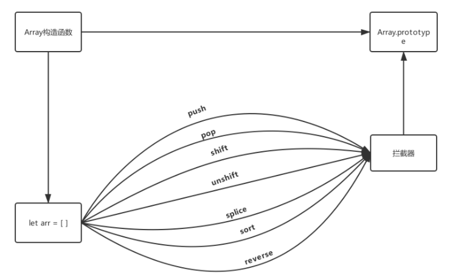
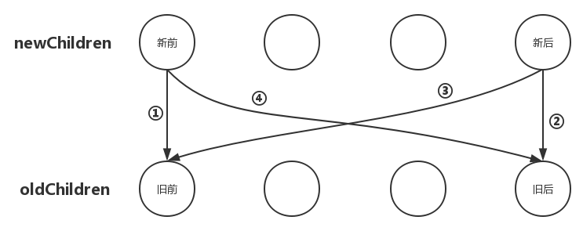
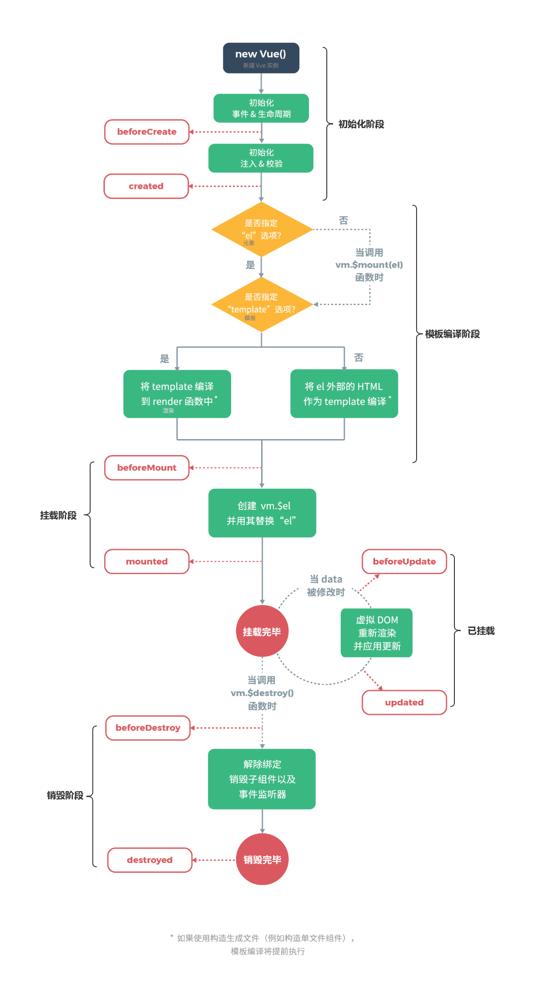
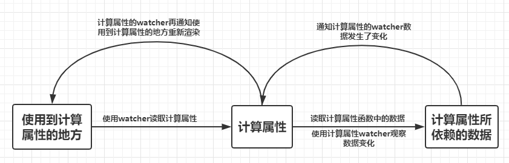

参考: <https://vue-js.com/learn-vue/start/>  
#### 变化侦测  
数据驱动视图(数据变化引起视图变化)  
`UI = render(state)`  
上述公式中 状态state是输入，页面UI输出，状态输入一旦变化了，页面输出也随之而变化。我们把这种特性称之为数据驱动视图。
我们知道`state`和`UI`都是用户定的，而不变的是这个`render()`。所以Vue就扮演了`render()`这个角色，当Vue发现`state`变化之后，
经过一系列加工，最终将变化反应在`UI`上。

##### Object的变化侦测  
`Object.defineProperty`使数据变得可观测
```js
let car = {}
let val = 3000
Object.defineProperty(car, 'price', {
  enumerable: true,
  configurable: true,
  get(){
    console.log('price属性被读取了')
    return val
  },
  set(newVal){
    console.log('price属性被修改了')
    val = newVal
  }
})
```
通过`Object.defineProperty()`方法给`car`定义了一个`price`属性，并把这个属性的读和写分别使用`get()`和`set()`进行拦截，
每当该属性进行读或写操作的时候就会触发`get()`和`set()`  
定义一个`observer`类，通过递归的方式，将一个正常的`object`转换成可观测的`object`  
value新增一个`__ob__`属性，值为该`value`的`Observer`实例。这个操作相当于为`value`打上标记，表示它已经被转化成响应式了，避免重复操作

##### 依赖收集
为每一个数据都建立一个依赖管理器(`Dep`)，把这个数据所有的依赖都管理起来  

在getter中收集依赖，在setter中通知依赖更新。  
在`getter`中调用了`dep.depend()`方法收集依赖，在`setter`中调用`dep.notify()`方法通知所有依赖更新  

谁用到了数据，谁就是依赖，我们就为谁创建一个`Watcher`实例  
数据变化时，我们不直接去通知依赖更新，而是通知依赖对应的`Watch`实例，由`Watcher`实例去通知真正的视图  

`Watcher`先把自己设置到全局唯一的指定位置`（window.target）`，然后读取数据。因为读取了数据，所以会触发这个数据的`getter`。
接着，在`getter`中就会从全局唯一的那个位置读取当前正在读取数据的`Watcher`，并把这个`watcher`收集到`Dep`中去。
收集好之后，当数据发生变化时，会向`Dep`中的每个`Watcher`发送通知。通过这样的方式，`Watcher`可以主动去订阅任意一个数据的变化。  
  

1. `Data`通过`observer`转换成了`getter/setter`的形式来追踪变化。
2. 当外界通过`Watcher`读取数据时，会触发`getter`从而将`Watcher`添加到依赖中。
3. 当数据发生了变化时，会触发`setter`，从而向`Dep`中的依赖（即`Watcher`）发送通知。
4. `Watcher`接收到通知后，会向外界发送通知，变化通知到外界后可能会触发视图更新，也有可能触发用户的某个回调函数等。


#### Array的变化侦测

在`Vue`中创建了一个数组方法拦截器，它拦截在数组实例与`Array.prototype`之间，
在拦截器内重写了操作数组的一些方法，当数组实例使用操作数组方法时，其实使用的是拦截器中重写的方法，
而不再使用`Array.prototype`上的原生方法

把它挂载到数组实例与`Array.prototype`之间  
把数据的`__proto__`属性设置为拦截器`arrayMethods`


### 虚拟DOM
把组成一个`DOM`节点的必要东西通过一个`JS`对象表示出来，那么这个`JS`对象就可以用来描述这个`DOM`节点，
我们把这个`JS`对象就称为是这个真实`DOM`节点的虚拟`DOM`节点  
用`JS`模拟出一个`DOM`节点，称之为虚拟`DOM`节点。当数据发生变化时，我们对比变化前后的虚拟`DOM`节点，
通过`DOM-Diff`算法计算出需要更新的地方，然后去更新需要更新的视图。  
#### VNode类
`VNode`类中包含了描述一个真实`DOM`节点所需要的一系列属性，
如`tag`表示节点的标签名，`text`表示节点中包含的文本，`children`表示该节点包含的子节点等。  
通过属性之间不同的搭配，就可以描述出各种类型的真实`DOM`节点  
节点类型
```
注释节点 text isComment
文本节点 text
元素节点 tag class attributes children
组件节点 
函数式组件节点
克隆节点 将已存在的节点复制一份，模板编译优化时使用
```
视图渲染之前，将`template`模板编译成`vnode`并缓存，数据变化需要重新渲染时，
将数据变化后生成的`vnode`与缓存下来的`vnode`进行对比，有差异的`VNode`对应的真实`DOM`节点就是需要重新渲染的节点
根据有差异的`vnode`创建出真实的`dom`节点插入到视图中，完成视图更新

#### dom-diff过程
patch: 对比两份vnode,以新的VNode为基准，改造旧的oldVNode使之成为跟新的VNode一样  
三种节点能够被创建并插入到dom中`createElm 元素节点(有没有tag)，文本节点，注释节点(isComment)`  
1. 创建节点

2. 删除节点 `removeNode 移除父节点的children`  
3. 更新节点  
```
静态节点: 只有纯文字，没有变量(数据的变化与其无关)  
1. vnode oldVnode 均为静态节点 (无需处理)
2. vnode为文本节点 (比较文本)
3. vnode为元素节点
    3.1 包含子节点 (递归更新)
    3.2 不包含子节点 (该节点为空节点，直接清空)
```


### 更新子节点
四种情况
```
遍历vnode 和 oldNode
for (let i = 0; i < newChildren.length; i++) {
  const newChild = newChildren[i];
  for (let j = 0; j < oldChildren.length; j++) {
    const oldChild = oldChildren[j];
    if (newChild === oldChild) {
      // ...
    }
  }
}
1.创建子节点
    创建节点 插入的合适位置是所有未处理节点之前，而并非所有已处理节点之后
2.删除子节点
3.移动子节点
    移动到所有未处理节点之前
4.更新节点
```

### 优化更新节点


为了避免双重循环数据量大时间复杂度升高带来的性能问题，而选择了从子节点数组中的4个特殊位置互相比对  
新前 旧后  
新后 旧后  
新后 旧前 (将old节点移动到所有未处理节点之后)  
新前 旧后 (将old节点移动到所有未处理节点之前)  

更新节点要以新VNode为基准，然后操作旧的oldVNode，使之最后旧的oldVNode与新的VNode相同  
从两边向中间循环  

### 模板编译
把用户在`<template></template>`标签中写的类似于原生HTML的内容进行编译，
把原生HTML的内容找出来，再把非原生HTML找出来，经过一系列的逻辑处理生成渲染函数，
也就是render函数的这一段过程称之为模板编译过程。   

```
用户写的模板 -> 模板编译 -> render函数 -> VNode -> patch -> 视图  
                            模板编译  |   虚拟dom
```
模板解析：生成抽象语法树(abstract syntax tree) parse  
优化阶段：遍历ast，找出静态节点，打上标记 optimizer  
代码生成：将ast转换成渲染函数 codegen  


#### 模板解析
模板解析其实就是根据被解析内容的特点使用正则等方式将有效信息解析提取出来，
根据解析内容的不同分为HTML解析器，文本解析器和过滤器解析器。
而文本信息与过滤器信息又存在于HTML标签中，所以在解析器主线函数parse中先调用HTML解析器
parseHTML 函数对模板字符串进行解析，如果在解析过程中遇到文本或过滤器信息则再调用相应
的解析器进行解析，最终完成对整个模板字符串的解析。  


### 生命周期 


1. 初始化
2. 模板编译
3. 挂载
4. 销毁

`new Vue()`执行vue的构造函数
```js
function vue(options) {
    this._init(options)
}
function _init(options) {
  const vm = this
  // 合并(mergeOptions)并挂载options
  // 初始化一些属性，事件，响应式数据...
  // callHook(vm, 'beforeCreate')
  // callHook(vm, 'created')
  // 判断是否传入el选项 
    // 传入：调用$mount函数进入模板编译挂载阶段
    // 没有：不进入下一个生命周期阶段，需要用户手动执行vm.$mount
}
```
合并配置，调用一些初始化函数，触发生命周期钩子函数，调用$mount开启下一个阶段。

```
钩子函数(生命周期钩子名称 -> 钩子函数数组)
这是因为Vue允许用户使用Vue.mixin方法（关于该方法会在后面章节中介绍）向实例混入自定义行为，Vue的一些插件通常都是这么做的。
所以当Vue.mixin和用户在实例化Vue时，如果设置了同一个钩子函数，那么在触发钩子函数时，就需要同时触发这个两个函数，
所以转换成数组就是为了能在同一个生命周期钩子列表中保存多个钩子函数。
callHook 触发钩子函数(遍历，依次调用钩子函数数组)
export const LIFECYCLE_HOOKS = [
  'beforeCreate',
  'created',
  'beforeMount',
  'mounted',
  'beforeUpdate',
  'updated',
  'beforeDestroy',
  'destroyed',
  'activated',
  'deactivated',
  'errorCaptured'
]
```

initLifecycle  
给实例挂载一些属性并设置默认值，包括以$开头的供用户使用的外部属性，
也包括以_开头的供内部使用的内部属性。  

$parent: 如果当前组件不是抽象组件并且存在父级，那么就通过while循环来向上循环，如果当前组件的父级是抽象组件并且也存在父级，
那就继续向上查找当前组件父级的父级，直到找到第一个不是抽象类型的父级时，将其赋值vm.$parent，同时把该实例自身添加进找到的父级的$children属性中。
这样就确保了在子组件的$parent属性上能访问到父组件实例，在父组件的$children属性上也能访问子组件的实例。   

$root: 当前实例的根实例`vm.$root = parent ? parent.$root : vm`  

initEvents  
父组件既可以给子组件上绑定自定义事件，也可以绑定浏览器原生事件。这两种事件有着不同的处理时机，浏览器原生事件是由父组件处理，
而自定义事件是在子组件初始化的时候由父组件传给子组件，再由子组件注册到实例的事件系统中。  
初始化事件函数initEvents实际上初始化的是父组件在模板中使用v-on或@注册的监听子组件内触发的事件。  
模板编译 -> 解析事件(解析标签`v-on @`)  
属性: 指令 解析属性修饰符(capture once passive native)`parseModifiers`
     事件 `addHandler( ... )`
```
addHandler()
根据modifier修饰符对事件名name做处理
根据modifier.native判断是原生事件 或 自定义事件
                        el.naticeEvents el.events
按照name对事件进行归类，将回调函数的字符串保留到对应的事件中

<child @select="selectHandler" 	@click.native="clickHandler"></child>
el.events = {
  select: {
    value: 'selectHandler'
  }
}

el.nativeEvents = {
  click: {
    value: 'clickHandler'
  }
}

```

父组件给子组件注册事件时，把自定义事件传递给子组件，在子组件实例化的时候进行初始化，浏览器的原生事件在父组件中处理  
实例初始化阶段调用的初始化事件函数initEvents实际上初始化的时父组件在模板中使用v-on或@注册的监听子组件内触发的事件  

父组件可以给子组件绑定自定义事件 和 浏览器原生事件
原生事件: 父组件处理
自定义事件: 在子组件初始化的时候由父组件传递给子组件，由子组件注册到实例的事件系统中  

inject/provide  
允许祖先插件向所有子孙后代注入依赖  
provide: 对象  
inject: 字符串数组/对象  

initInjections  
provide选项注入的值作为数据入口  
初始化顺序：inject -> initState -> initProvide  
先将inject中提供的数据转换成键值对  
```
将inject中的所有对象进行转换(normalizeInject规范化函数)
const Child = {
    inject: {
        foo: {
            from: 'foo',
            default: 'xxx' // 有默认属性的话有该属性
        }   
    }
}
获取所有的key, 遍历拿到from属性(上级父组件提供的源属性)  
while循环, 不断向上级父组件的_provided属性值查找
找到了: 放入result
没找到: 判断是否有默认值(`default`本身 或 工厂函数返回值), 没有则抛出异常
```

initState  
初始化 实例的状态选项(props, methods, data, computed, watch)  
vue2.0不再对数据进行侦测，将侦测粒度提升到组件，为组件新增了vm._watchers属性，存放该组件内用到的所有状态依赖  
当状态变化时，通知组件，组件内部使用虚拟dom进行数据对比  

规范化数据  
```
最终结果
props: {
    name: {
        type: xxx
    }
}
```
initProps: 
```
定义变量
propsData: 父组件传入的真是props数据
props: props中的所有属性都会保存到这里
keys: 保存props对象中的key
isRoot: 当前组件是否为根组件 

判断当前组件是否是根组件:  
是：将props数组转换成转换成响应式
不是：...

遍历propsOptions 将键名加入keys
检验父组件传入的数据类型是否匹配，将键和值添加到props 

检验数据类型(validateProp)：
参数：
keys: 遍历propOptions时拿到的属性名
propOptions: 规范化后的props选项
propsData: 父组件传入的数据
vm: 当前实例
判断是否为布尔类型 如果没有传入默认值false
                传入了: 一系列判断
判断属性值与属性名相等时：将属性名由驼峰转换成-连接的字符串
其他类型如果没有传入默认为undefined，获取默认值(getPropDefaultValue)，转换成响应式的
对象或数组的默认值必须从工厂函数中获取
assertProp 判断父组件传递过来的真实值是否与prop的type类型匹配
自定义校验函数 validator
```

初始化methods  
函数是否存在函数体  
判断 method 中的某个方法名是否与 props 重复  
命名是否符合规范(_或$开头就抛异常)  
挂载到vm实例上  

初始化data  
必须为对象  
判断是否与methods 和 props 属性名重复  
挂载到vm实例上  

初始化computed  
结果会被缓存，响应式属性变化时才会重新计算  
```
computed: {
    // 函数，默认取值器
    a: function() {
        return this.x * 2
    },
    // 对象：包含取值器 和 存值器
    b: {
        get: function() {
            return this.x + 2
        },
        set: function(x) {
            return x - 2;
        }
    }
    
    initComputed() // 检查取值器
    defineComputed() // 为实例vm上设置计算属性
    创建具有缓存功能的getter(createComputedGetter())
    
    createComputedGetter()
}
```


初始化watch  
侦听某个已有的数据，当该数据发生变化时执行对应的回调函数  
watch选项是一个对象，键时需要观察的表达式，值是对应回调函数(方法名，包含选项的对象)  
```vue
var vm = new Vue({
  data: {a: 1, b: 2, c: 3},
  watch: {
    a: function(val, old) {
      console.log('new: %s, old: %s', val, old)
    },
    b: 'someMethod', // 侦听方法
    c: {
      handler: function(val, old) {},
      deep: true, // 深度监听，会在任何被侦听的对象的property改变时被调用，不论被嵌套多深
    },    
  }
})
```

#### 模板编译阶段(获取用户传入的模板内容并将其编译成渲染函数)
完整版(vue.js存在) 多一个编译器，自动将template选项中的模板字符串编译成渲染函数的代码renderjams  
初始化 -> 模板编译 -> 挂载  
```vue
new Vue({
  template: '<div>{{ hi }}</div>'
})
```
运行版(vue.runtime.js不存在)  
初始化 -> 挂载  
```vue
new Vue({
  render(h) {
    return h('div', this.hi)
  }
})
```
vm.$mount  
1. 根据传入的el参数获取dom元素
2. 用户没有首先render函数的情况下获取传入的模板template
3. 将获取到的template编译成render函数

1.1 el参数可以是元素 也可以是字符串类型的元素选择器  
     获取到el对应的dom不允许为body和html(可能会破坏整个dom文档)  

#### 挂载阶段
创建vue实例并用其替换el选项对应的dom元素，将模板渲染到视图上，同时开启对模板中数据的监控，当数据发生变化时通知其依赖进行视图更新  

### 销毁阶段
vm.$destroy 将当前的vue实例从其父级实例中删除，取消当前实例上的所有依赖追踪并移除实例上的所有时间监听器  

### 实例方法 (vm.$set, vm..$delete, vm.$watch)

1. vm.$watch
  观察vue实例变化的一个表达式或计算属性函数。回调函数得到的参数为新值和旧值。表达式直接说监督的键路径。
   对于更复杂的表达式，用函数代替  
  在编译(不是替换)对象或数组时，旧值将于新值相同，因为他们的引用执行同一个对象/数组。vue不会保留变异之前值的副本  
  vm.$watch返回一个取消观察函数，用来停止触发回调
   
```vue
var unwatch = vm.$watch('a', callback, {deep: true})
选项 deep 发现对象内部值的变化
immediate 将立即以表达式的当前值触发回调，不能在第一次回调时取消侦听给定的property(需要检测函数的可用性)
unwatch() // 取消观察(watcher.teardown())
```
  深度观察  
  成为被观察数据的依赖，创建watcher实例的时候把对象内部所有的值都帝国的读一遍  
  watcher实例会被加入到对象内所有值的依赖列表中，之后当对象内的某个值发生变化是能够得到通知  

2. vm.$set(target, propertyName/index, value) 
  向响应式对象中添加一个属性，确保这个新属性时响应式的，且触发视图更新    
  不能是vue实例，或vue实例的根数据对象  
   如果传入的时数组并indes是有效索引的话，max(currLen, index)作为数组的新长度，使用splice方法添加近期  
   

3. vm.$delete(target, propertyName/index) == Vue.delete


### 事件方法
1. vm.$on(event {Array | string}, callback)  
2. vm.$emit(eventName {String}, [...args])
监听当前实例上的自定义事件。事件可以有vm.$emit触发。回调函数接收所有传入事件触发函数的额外参数  
   $on 订阅 将回调函数加入_events中  
   $emit() 发布 从_events中获取事件名对应的回调函数，传入附加参数，执行回调函数  
_event 生命周期初始化阶段的初始化事件initEvents函数中，给当前实例绑定_events属性并赋值为空对象  
   所有绑定在该实例上的事件都会存储在该属性中

3. vm.$off([event, callback])
移除自定义事件监听器  
   没有参数：移除所有事件监听器 (将_events清空)
   只有事件：移除该事件所有的监听器 (遍历_events 将event数组中的每一个事件都递归调用$off移除掉)
   同时提供事件和回调：只移除这个回调的监听器

4. vm.$once(event, callback)
监听一个自定义事件，只触发一次

### 生命周期相关方法
1. vm.$mount([element or selector]) 返回实例自身  
   如果Vue实例在挂载时没有收到el选项，它将处于未挂载状态，没有关联的dom元素    
   使用vm.$mount() 手动挂载一个未挂载的实例  

2. vm.$forceUpdate()  
   迫使vue实例重新渲染。仅仅影响实例本身和插入插槽内容的子组件，而不是所有的子组件  
   搜集依赖就是搜集watcher，依赖更新就是watcher调用update方法更新，实例依赖的数据发生变化时，
   就会通知实例watcher去执行update方法进行更新  
   实例的重新渲染就是实例watcher执行了update方法  

3. vm.$nextTick([callback]) == Vue.nextTick()  
   将回调延迟到下次dom更新循环之后执行。在修改数据之后立刻使用它，然后等待dom更新。  
   vue在更新dom时是异步执行的。只要侦听到数据变化，vue将开启一个事件队列，并缓冲在同一事件循环中发生的所有数据变更。  
   如果同一个watcher被多次触发，只会被推入到事件队列中一次。在缓冲是去除重复数据对于避免不必要的计算和dom操作非常重要  
   
   更新完数据后，向基于更新后的状态来做点什么，使用该函数，把基于更新后的dom状态所需要的操作放入回调函数callback中  
   回调函数将在dom更新完成后被调用  
   
   **js的运行机制**
    1. 所有的同步任务都在主线程上执行，形成一个执行栈(execution context stack)
    2. 主线程外，还存在一个 任务队列(task queue) .只要异步任务有了运行结果，就在任务队列中放置一个事件  
    3. 一旦执行栈中的所有同步任务执行完毕，系统会读取 任务队列 ，看里面有哪些事件。那些对应的异步任务，结束等待状态，进入执行栈，开始执行  
    4. 主线程不断重复上面三步
    主线程的执行过程就是一个tick，所有的异步任务都是通过 任务队列 来调度。任务队列中存放的是一个个任务  
       1. 宏任务 setTimeout new Promise() MessageChannel postMessage  耗时长  
       2. 微任务 Promise.then
    执行完一个宏任务后，去清空宏任务对应的微任务队列中所有的微任务  

4. vm.$destroy()  
   完全销毁一个实例。清理其与其他实例的连接，解绑它的全部指令及事件监听器  
   触发beforeDestroy() destroyed()钩子  


### 全局API
1. 实例方法：将方法挂载到vue原型上
2. 全局API：直接在vue上挂载方法 (12个)
```vue
Vue.extend, Vue.nextTick, Vue.set, Vue.delete
Vue.directive, Vue.filter, Vue.component, Vue.use
Vue.mixin, Vue.compile, Vue.observable, Vue.version
```
1. Vue.extend(options)  
  使用基础vue构造器，创建一个子类。参数是一个包含组件选项的对象  
   data选项必须是函数  
   创建子类：给子类加上独有的属性，同时将父类的公共属性复制到子类中  
   1. 判断之前是否创建过，有的话从缓存中取出结果返回，没有的话创建完之后放入缓存
    2. 获取到传入的选项参数中的name字段，并检验其是否合法  
    3. 创建一个sub类，让该类去继承Vue，具备一些基础能力
    4. 将父类的原型prototype集成到子类中，为子类添加唯一标识cid
    5. 将父类的options与子类的进行合并
    6. 将父类保存到子类的super属性中，确保在子类中能拿到父类  
    7. 如果选项中存在props，computed，初始化它
    8. 将父类的一些属性赋值到子类中
    9. 给子类增加三个独有的属性 
    10. 使用父类的cid作为key，创建好的子类sub作为value，放入缓存池cachedCtors  
    
5. Vue.directive(id, [definition])  
注册或获取全局指令  
根据是否传入了definition参数来决定本次操作是注册还是获取。  
注册指令是将定义好的指令存放在某个位置，获取指令是根据指令id从存放指令的位置来读取指令。  
```vue
    // 注册
    Vue.directive('my-directive', {
      bind: function () {},
      inserted: function () {},
      update: function () {},
      componentUpdated: function () {},
      unbind: function () {}
    })
    
    // 注册 (指令函数)
    Vue.directive('my-directive', function () {
      // 这里将会被 `bind` 和 `update` 调用
    })
    
    // getter，返回已注册的指令
    var myDirective = Vue.directive('my-directive')
```

6. Vue.filter(id, [definition])  
注册或获取全局过滤器
```vue
    // 注册
    Vue.filter('my-filter', function (value) {
      // 返回处理后的值
    })
    
    // getter，返回已注册的过滤器
    var myFilter = Vue.filter('my-filter')
```

7. Vue.component(id, [definition])  
注册或获取全局组件  
```vue
    // 注册组件，传入一个扩展过的构造器
    Vue.component('my-component', Vue.extend({ /* ... */ }))
    
    // 注册组件，传入一个选项对象 (自动调用 Vue.extend) 如果没传入name属性，将组件id作为name属性
    Vue.component('my-component', { /* ... */ })
    
    // 获取注册的组件 (始终返回构造器)
    var MyComponent = Vue.component('my-component')
```

8. Vue.use(plugin)  
   安装Vue.js插件。  
   如果插件是一个对象，必须提供install方法  
   如果是一个函数，会被作为install方法  
   install方法调用时，会将vue作为参数传入  

   需要在 new Vue() 之前被调用  

9. Vue.mixin(mixin)  
全局注册一个混入，影响注册之后所有创建的每个vue实例  
插件作者可以使用混入，向组件注入自定义的行为  
通过修改Vue.options属性影响之后的所有vue实例  

10. Vue.compile(template)  
在render函数中编译模板字符串  

11. Vue.observable(object)  
让一个对象可响应。用其处理data函数返回的对象，内部调用observe方法  
    返回的对象可以直接用于渲染函数 和 计算属性 内，并会在发生变化时触发响应的更新  
    也可作为最小化跨组件的状态存储器  

12. Vue.version  
提供字符串形式的vue安装版本号(读取package.json中的version字段)  


### 过滤器
**组件中的所有选项都会被合并到当前实例的$options属性中**
1. 使用方式  
```vue
    {{ message | capitalize }} // 双花括号插值中
    <div v-bind:id="rawId | formatId"></div> // v-bind表达式中
    
    {{ message | filterA('arg1', arg2) | filterB}} // 串联过滤器
    接收三个参数，1. message 2. 'arg1' 3. arg2
    第一个参数是表达式的值，或前一个过滤器的结果
```
在组件的选项中定义本地过滤器  
在Vue实例之前使用全局API Vue.filter定义全局过滤器  

2. 原理  
   根据过滤器id从本地注册中查找  
   将过滤器id转换成驼峰查找  
   将过滤器id转换陈首字母大写查找  
   从原型链中查找  

3. 串联过滤器原理  
   对于多个串联过滤器，在调用过滤器函数传递参数时，后一个过滤器的输入参数是前一个过滤器的输出结果。  
   `filterB( filterA(message) )`  

4. 解析过滤器  

1. 模板编译  
三个解析器：  
    1. parseHtml html解析器  processAttrs 处理标签属性  v-bind  
    2. parseText 文本解析器  {{ message | filterA }}  
    3. parseFilters 过滤器解析器  

2. parseFilters  
 `{{ message | filterA | filterB(arg) }} -> _f("filterB")(-f("capitalize")(message), arg)`  
如果过滤器id没有括号，直接构造_f函数，如果有，先取出过滤器id，再取出参数  
_f对应的是resolveFilter函数，通过模板编译会生成一个_f函数调用字符串， 
当执行渲染函数的时候，就会执行_f函数，从而让过滤器生效。  


###  自定义指令
```vue
    Vue.directive("") -> Vue.options['directives']  
    vm.directive('') -> vm.$options['directives']
    无论是使用哪一种方式定义的指令它都是将定义好的指令存放在指定的地方
```
在虚拟DOM渲染更新的时候，它在执行相关操作的同时，还会在每个阶段触发相应的钩子函数，
我们只需监听不同的钩子函数，就可以在虚拟DOM渲染更新的不同阶段做一些额外的事情。  


