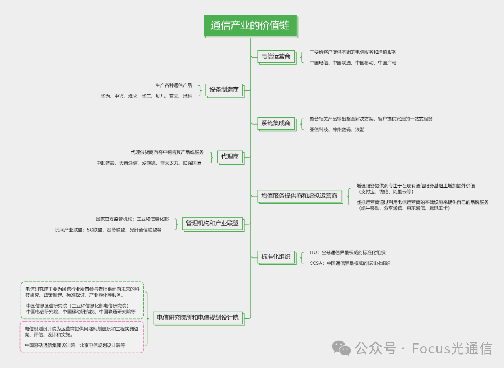
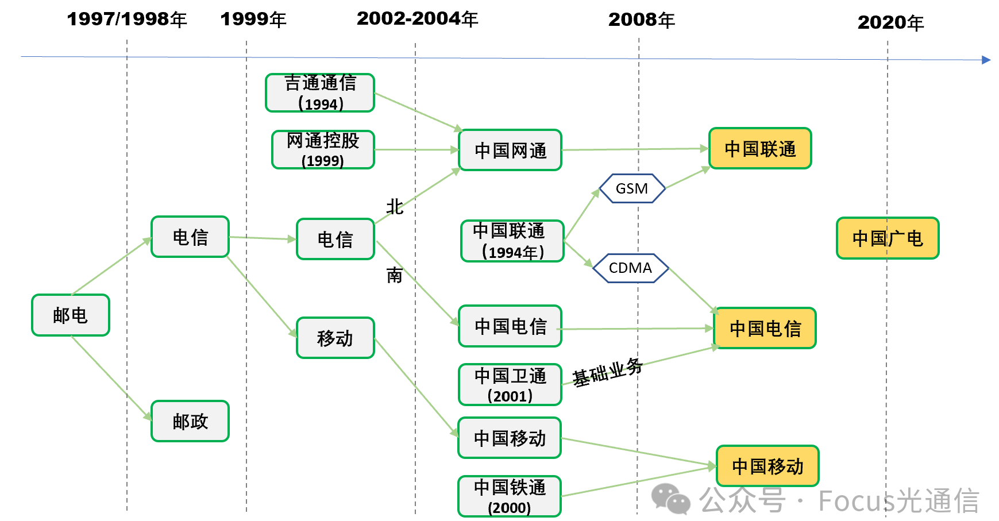
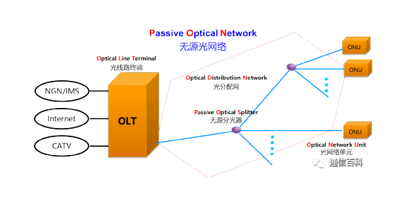
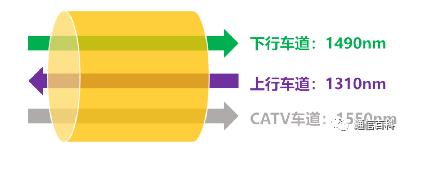
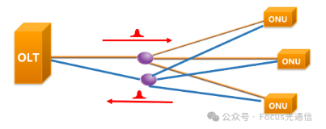
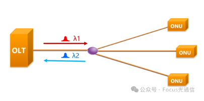

# 广通信

## 通信产业的价值链

**1. 电信运营商**

**电信运营商**主要给客户（企业、家庭、个人等）提供基础的电信服务和增值服务。电信运营商一般较少开发软硬件，主要是购买（或合作）设备制造商的产品来进行组网，并搭配自己的资费政策一起销售。

电信运营商的商业模式主要是通过提供服务收取合理的费用，从而创造相应的利润。

国内的电信运营商有：中国电信、中国联通、中国移动、中国广电。

**2. 设备制造商**

**设备制造商**就是生产各种通信产品（交换机、路由器、手机、线缆、基站等）并卖给电信运营商、行业企业客户或最终用户，当然也可能卖给其他设备制造商。

主流的设备制造商有：华为、中兴、烽火、华三、普天、思科。

**3.系统集成商**

**系统集成商**基于其专业知识和经验，针对客户的特殊需求，将各种不同的部件、设备或系统组合起来，形成一套完善的解决方案卖给客户。系统集成商犹如一位能工巧匠，合理整合资源并使其能够协同工作，发挥出整体的最大效能，为客户提供完善的一站式服务。

国内主要的通信行业系统集成商有：亚信科技、神州数码、浪潮

**4.代理商**

**代理商**主要是代理供货商（设备制造商或电信运营商）向客户销售其产品或服务，通过赚取销售佣金或差价利润来盈利。代理商犹如一座桥梁，连接着供货商与最终用户。代理商有其存在的价值，比如代理商可以帮助供应商扩大市场范围，进入新地区或细分市场；代理商一般有良好的客户关系，可为供应商提供稳定的销售渠道；代理商还可以帮助供应商分散市场风险，避免过度依赖单一市场或客户等。

国内主流的通信行业代理商有：中邮普泰、天音通信、爱施德、普天太力、联强国际

**5.增值服务提供商和虚拟运营商**

**增值服务提供商**（Value-Added Service Provider, VASP）通过与电信运营商合作，利用运营商的网络基础设施来提供额外服务或功能，为的是满足客户的特定需求。

国内常见的增值服务提供商示例：

- **短信和彩信服务提供商**：提供定制化的短信和彩信服务，如企业通知、验证码发送等。
- **移动支付服务提供商**：如支付宝、微信支付等，提供便捷的移动支付解决方案。
- **在线内容提供商**：如腾讯、爱奇艺、优酷等，提供视频、音乐、新闻等内容服务。
- **云计算服务提供商**：如阿里云、腾讯云等，提供云存储、云计算资源和相关服务。
- **在线游戏服务提供商**：如网易游戏、腾讯游戏等，提供在线游戏服务和相关产品。
- **社交媒体平台**：如微博、微信等，提供社交网络服务和广告推广服务。
- **搜索引擎服务提供商**：如百度，提供搜索服务和相关广告产品。

**虚拟运营商**（Virtual Network Operator, VNO）通常依托于自身的品牌优势或业务特色，与电信运营商合作，通过租用网络资源来提供具有竞争力的通信服务。虚拟运营商的业务模式有助于增加市场竞争，为消费者提供更多选择。虚拟运营商的业务模式主要有：

- **品牌服务**：虚拟运营商通常有自己的品牌和市场定位，提供具有竞争力的套餐和服务。
- **客户定制**：提供针对特定用户群体的定制化服务，如针对年轻人、老年人或特定行业的套餐。
- **成本效益**：由于没有大规模的网络建设和维护成本，虚拟运营商往往能提供更灵活的定价策略。
- **创新服务**：虚拟运营商可能会引入新的服务和商业模式，如基于使用量的计费方式、社区服务等。

虚拟运营商的客户通常不会意识到他们使用的是虚拟运营商的服务，因为呼叫和数据服务都是通过合作的电信运营商的网络提供的。

国内常见的虚拟运营商：蜗牛移动、分享通信、京东通信、苏宁互联、阿里巴巴通信、小米移动、腾讯王卡等

**6.管理机构和产业联盟**

国家机构和公共部门构成了通信行业的官方架构，负责制定行业规范和进行监督管理。例如，工业和信息化部作为中国通信领域的官方监管机构，承担着确立行业标准、颁发运营许可证、监管网络互联互通以及协调相关事务等重要职责。

除了政府机构，通信行业内部也存在着多种行业协会或产业联盟，这些组织通常属于非官方性质，由行业内的企业自发组成。这些联盟没有强制的法律权力去规定成员企业的行为，它们更多的是提出一些指导性建议，鼓励成员企业自愿遵循，以促进行业自律和健康发展。

常见的产业联盟举例：

- **5G联盟**：专注于5G技术的研发、标准化和推广。
- **宽带联盟**：致力于提升宽带网络的速度和普及率。
- **光纤通信联盟**：推动光纤到户（FTTH）和光纤网络技术的发展。
- **移动通信联盟**：包括GSM协会（GSMA）等，推动移动通信技术标准化和全球化。
- **互联网协会**：如国际互联网协会（ISOC），关注互联网的开放性、可访问性和创新。
- **无线通信标准组织**：如Wi-Fi联盟，负责Wi-Fi标准的推广和认证。
- **智能终端产业联盟**：关注智能手机和智能硬件的研发和市场发展。
- **物联网联盟**：推动物联网技术标准化和应用推广。

**7.标准化组织**

全球来看通信界最权威的标准化组织是ITU，我国最权威的标准化组织是“中国通信标准化协会”（CCSA）（2002年，北京成立）。

CCSA的主要任务是更好地开展通信标准研究工作，把通信运营企业、制造企业、研究单位、大学等关心标准的企事业单位组织起来，公平、公正、公开地制定标准，进行标准的协调把关，把高技术、高水平、高质量的标准推荐给政府，把具有我国自主知识产权的标准推向世界，支撑我国的通信产业，为世界通信做出贡献。

**8.电信研究院所和电信规划设计院**

**电信研究院**主要为政府、电信运营商、设备制造商以及通信行业所有的参与者提供面向未来的科技研究、政策制定、标准探讨、入网检测、专家和研究生培养等服务，如中国信息通信研究院（工业和信息化部电信研究院）、中国电信研究院、中国移动研究院、中国联通研究院等。

在我国，各级**电信规划设计院**为运营商提供网络规划建设和工程实施咨询、评估、设计和实施，如中国移动通信集团设计院、北京电信规划设计院和江苏邮电规划设计院等。

电信研究研所与电信规划设计院的主要区别在于：

- **工作重点**：电信研究院所更侧重于技术研发和创新，而电信规划设计院更侧重于网络规划和工程实施。
- **服务对象**：电信研究院所可能为更广泛的行业参与者提供研究和咨询服务，而电信规划设计院通常为特定的建设项目或运营商提供专业服务。
- **成果形式**：电信研究院所的成果可能是研究报告、技术标准或专利，而电信规划设计院的成果通常是网络设计方案和项目实施蓝图。

两者虽然在某些方面有所交叉，如都可能提供技术咨询服务，但它们的核心职能和工作流程有明显的不同。电信研究院所是推动行业发展的创新引擎，而电信规划设计院是确保电信网络建设和运营顺利进行的关键支撑。

总而言之，通信行业价值链是一个动态的生态系统，每个角色都在其中发挥着不可或缺的作用。随着技术的不断进步和市场需求的不断变化，价值链的各个环节也需要不断创新和调整，以适应新的挑战和机遇。通过紧密合作和协同发展，通信行业的所有参与者可以共同推动行业的繁荣，为社会创造更大的价值。

## 中国运营商的发展历程

## PON网络架构及数据传输方式

### 1. PON网络架构

- PON是一种点到多点（P2MP）结构的无源光网络；

- PON由光线路终端OLT、光网络单元 ONU和光分配网ODN组成；
- PON之所以被称为“无源光网络”，特指的是ODN部分无源（POS，**无源分光器**，是一个物理的光学器件，不需要外接电源）；
- PON内部可以采用一级分光，也可以采用**二级分光**（实际工程中，二级居多）；
- PON的接入半径（OLT与ONU的距离）一般规划在20公里以内（20公里是物理距离）。其中，城市接入一般在5-10公里，偏远的山村或稀疏地区可能存在大于10公里甚至15公里的情况。  

### 2. PON数据传输方式

- 在OLT与POS之间其实只有一根光纤，如何实现上下行的数据在一根光纤中传输呢？

【答案】：划分不同的车道，即规划不同的波长。

【解析】：在PON网络中，上下行通信所采用的波长是不一样的，比如EPON/GPON同属于1G PON技术，它们下行波长规划的是1490nm，上行波长规划的是1310nm，互不影响，完全可以实现双向全双工的通信。此外，还有广电的CATV业务，单独的波长规划时1550nm。

- 为什么规定下行波长是1490nm，上行是1310nm，而不是反过来呢？

【答案】：成本考虑。

【解析】：标准制定的时候，1310nm的光器件已经相对来说比较成熟，成本较低，而1490nm成本较高。PON是一个点到多点的架构，那么我们自然要将成本比较低器件放在多点侧的发端，这样才会大量的降低PON网络初期的部署成本。

**PON下行采用广播的方式传输数据，上行采用的是TDMA的方式传输数据。**

-  PON下行为何采用广播的方式传输数据呢？

【答案】：因为简单实用。

【解析】：PON的下行方向是指从OLT到ONU的这个方向，这个方向发端与收端的数量对比关系是“1对多”的关系，那我们自然就会选择用广播的方式来发送数据，因为这样最省事。同时，下行因受限于无源分路器的物理特性，PON口发出的数据经过无源分路器后平均分配至每一分路，其无源物理特性无法控制某一分路的通与不通，仅能实现单纯分路功能，故下行依据物理分路特性实现了被动广播的现象。

PON下行采用广播，每个ONU都能收到其他ONU的数据，如何保证数据安全？

【答案】：ONU主动过滤，同时数据有加密。

【解析】：一方面，ONU会根据相应的过滤条件主动过滤属于自己的数据，如通过ONU ID（GEM-PORT ID）过滤接收属于自己的数据；另一方面，OLT给每个ONU发送的数据会进行加密（如GPON的AES-128），且加密的密钥是由每个ONU产生并发给OLT的，ONU不会知道其他ONU的密钥，故也难解密属于其他ONU的数据。

PON上行为何采用 时分多址（Time division multiple access，缩写：TDMA）的方式传输数据呢？

【答案】：实现多ONU同时传输数据，公平竞争。

【解析】：PON的上行方向跟下行方向是反的，即指ONU到OLT的方向，这个方向发端与收端的数量对比关系是“多对一”的关系。既然是“多对一”的关系，肯定就不能让每个ONU想当然的发送数据了，否则就会存在同波长光信号叠加（如GPON的1310nm），OLT接收后也无法读取数据，出现误码帧或未知帧提示，并将其丢弃。

**TDMA，它将上行链路分成不同的时隙，再将这些时隙根据需要分给不同的ONU，ONU在属于自己的时隙发送数据。**

ONU的发光时间严格受OLT指定，它是不会主动发光的，也不会长时间发光的。一旦某个ONU主动发光了或者长时间发光了，这个ONU就是一个“流氓ONU”，会影响整个PON口下的业务。

## PON技术分类：WDMA PON与TDMA PON

PON在上行方向（从ONU到OLT）是“多点对一点”的结构，多个ONU都向一个OLT发送数据。光分/合路器保证了每一个ONU发送的信号不会被其他ONU所检测到，然而却不能避免：**不同ONU同时发送的信号可能“碰撞”**。

PON上行方向就应该采用一种**信道分割机制**避免数据“碰撞”，进而公平地共享主干光纤和资源。

### 1. 波分多址接入（Wavelength Division Mutiple Access，WDMA）

让各个ONU工作在不同的波长上，**成本太高不可行**

### 2. 时分多址接入（Time Division Multiple Access，TDMA）

要求每个ONU必须只在自己的发送窗口（也称时隙）里发送数据。

- 双纤双向PON：占用光纤资源，也会引入多的光分路/合路器

- 单纤双向PON：需要使用两个波长

## TDMA PON技术演进历史

| 序号 | PON口技术制式      | 下行速率(Gbit/s) | 上行速率(Gbit/s) |
| ---- | ------------------ | ---------------- | ---------------- |
| 1    | GPON               | 2.5              | 1.25             |
| 2    | EPON               | 1.25             | 1.25             |
| 3    | 10G EPON           | 10               | 1                |
| 4    | XG-PON             | 10               | 2.5              |
| 5    | XGS-PON            | 10               | 10               |
| 6    | Combo PON(XG-PON)  | 10/2.5           | 2.5/1.25         |
| 7    | Combo PON(XGS-PON) | 10/2.5           | 10/1.25          |

