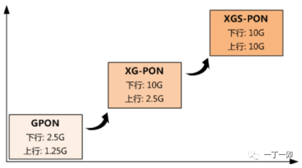
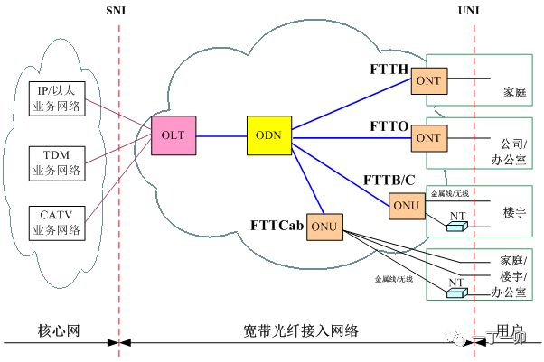
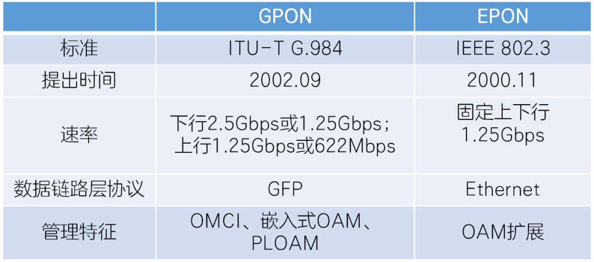
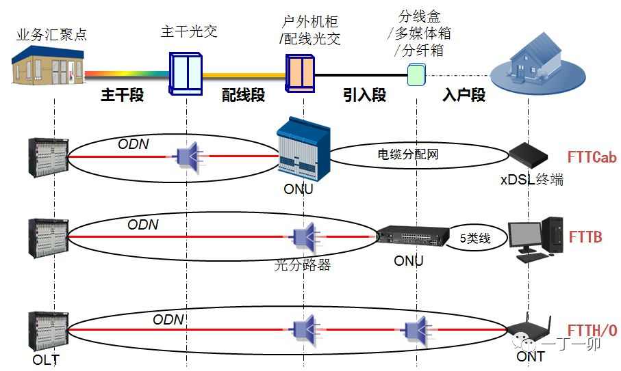
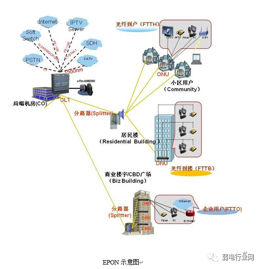
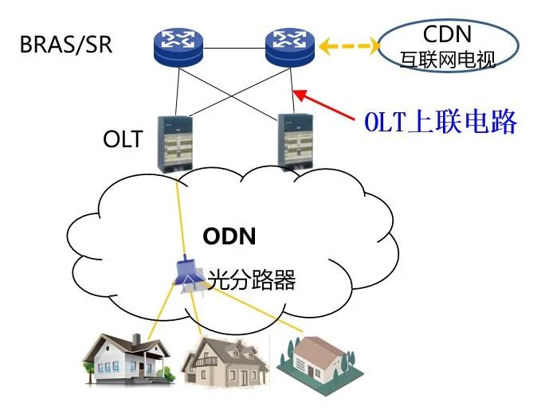
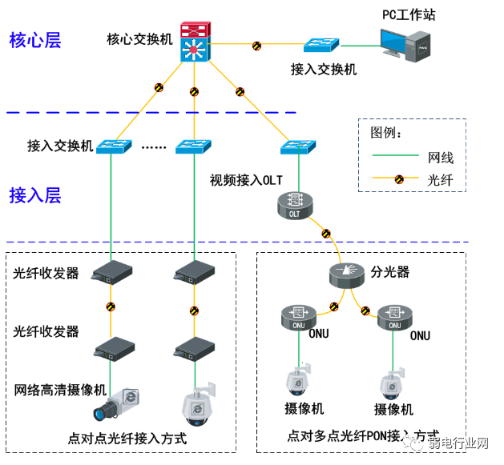

# 1. [什么是XGS-PON？XGS-PON是如何与GPON、XG-PON共存的？](https://mp.weixin.qq.com/s/w-OCzDiZehe1XahmunJKzQ)

XG-PON和XGS-PON均属于GPON系列，从技术路标上，XGS-PON是XG-PON的技术演进，支持GPON、XG-PON和XGS-PON 三种类型ONU的混合接入。

XG-PON和XGS-PON都是10G EPON，主要区别在于：

- XG-PON是不对称PON，PON口的上/下行速率为2.5G/10G；
- XGS-PON是对称PON，PON口的上/下行速率为10G/10G。

# 2. 宽带光纤入户

从OLT至用户属于宽带光纤接入网，所谓接入网是指骨干网络到用户终端之间的所有设备。

- OLT：光线路终端 optical line terminal，一个OLT通过分光器可以挂多个ONU；实现两个功能，对上游，完成PON网络的上行接入；对下游， 将获取到的数据通过ODN网络发送分配到所有ONU用户终端设备

- ODN：光配线网Optical Distribution Network 是OLT和ONU之间的光传输物理通道，主要功能是完成光信号的双向传输，通常由光纤光缆、光连接器、光分路器以及安装连接这些器件的配套设备组成，其中最重要的部件是分光器常，用分光器的分路比有1:2、1:4、1:8、1:16、1:32、1:64几种

- ONT：光网络终端 Optical Network Terminal，FTTH的最末端单元，俗称“光猫”；ONT是ONU的组成部分

- ONU：光网络单元 Optical Network Unit ；在FTTx网络（点此快速了解FTTx）不同的部署ONU接入方式也有所不同，例如 FTTC(Fiber To The  Curb)：ONU放置在小区的中心机房；FTTB(Fiber To The Building)：ONU放置在楼道的接线箱；FTTH(Fiber  To The Home)：ONU放置在家庭用户中

- PON：无源光纤网络 Passive Optical Network：是利用点对多点拓扑和分光器将数据从单个传输点传送到多个用户端点的光纤网络，所谓“无源”是指 (光配线网中) 不含有任何电子器件及电子电源，ODN全部由光分路器 (Splitter) 等无源器件组成，不需要贵重的有源电子设备

  - GPON：千兆无源光网络
  - EPON：以太网无源光网络

  

- POS：无源分光器

# 3. FTTR

https://mp.weixin.qq.com/s/6hV7dWvRG1uHeFcD4BhUng

FTTR中的“R”是Room的缩写，指的是光纤到用户家2个及以上房间，并在相应房间内安装光猫，每个光猫服务家庭内1至多个房间。

# 4. 上联链路

OLT上联电路通常指OLT上联至BRAS的电路，当前，OLT上联电路的带宽主要分10GE和GE两种。

通常，OLT上联电路的带宽利用率峰值达到70%就需要扩容。这里所说的带宽利用率值一般来自OLT网管，指的是15分钟平均带宽利用率。但用户的上网体验是受实时（10ms级别）带宽利用率影响的，当上联电路的实时带宽利用率峰值达100%（实际只是比较接近100%）时，该OLT所带用户的网速就可能会受到影响。

# 交换机

交换机（Switch）意为"开关"是一种用于电（光）信号转发的网络设备，实现设备与设备之间数据交换，达到相互访问功能。它可以为接入交换机的任意两个网络节点提供独享的电信号通路。最常见的交换机是以太网交换机。交换机总类非常多，不同总类有不同叫法，按设备层级接入有接入型交换机，汇聚型交换机及核心交换机；还有交换层分为二层交换机、三层交换机、四层交换机等。

# 5. ONU弱光

ONU就是我们俗称的“光猫”，ONU弱光是指ONU接收的光功率小于ONU接收灵敏度的现象。ONU的接收灵敏度指的是ONU正常工作时可接收的最小光功率，通常，家宽ONU的接收灵敏度指标为-27dBm；所以，一般将ONU收光功率低于-27dBm定义为ONU弱光。ONU弱光主要影响网速

ONU只在接收到下行光信号时才被动发光，当ONU接收不到下行光信号时，网络上行也随之中断。

https://mp.weixin.qq.com/s/Dae1QU-00rm112a87Q3vsg

