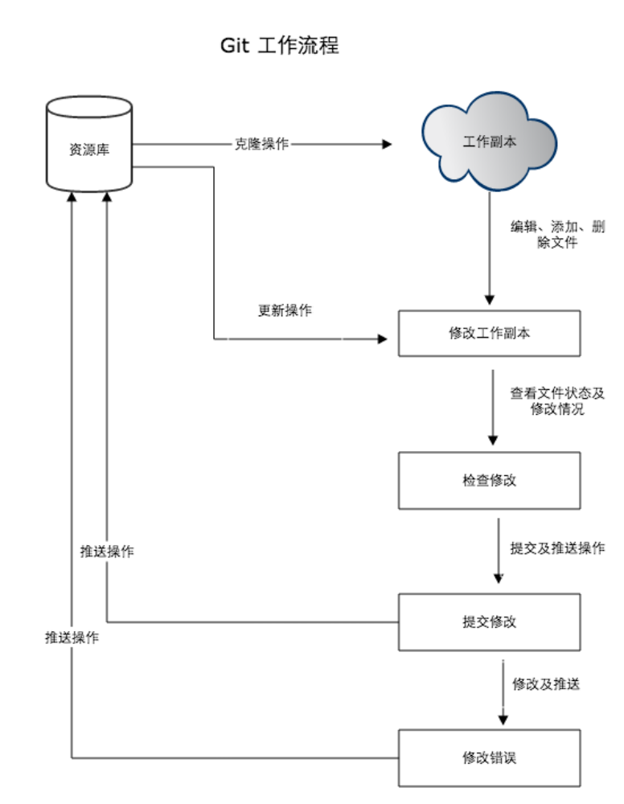

#### git
1.git是分布式的，svn不是  
2.git内容按元数据方式存储，svn是按文件  
3.git分支和svn不同  
4.git没有全局版本号，svn有  
5.git的内容完整性要优于svn  

工作流程  
- 克隆 Git 资源作为工作目录。
- 在克隆的资源上添加或修改文件。
- 如果其他人修改了，你可以更新资源。
- 在提交前查看修改。
- 提交修改。
- 在修改完成后，如果发现错误，可以撤回提交并再次修改并提交。  
  

工作区：电脑里能看到的目录  
暂存区(stage/index)：.git/index目录  
版本库：隐藏的.git目录  

#### 创建仓库  
git init 生成.git目录，包含资源的元数据  
git init newRepo  
git add fileName  
git commit -m '初始化项目版本'  

git clone <repo> 克隆项目  
git clone <repo> <directory> 克隆项目到指定目录  
git clone http://github.com/Qinguishuang/Something  

git当前配置  
git config --list  
```
diff.astextplain.textconv=astextplain
filter.lfs.clean=git-lfs clean -- %f
filter.lfs.smudge=git-lfs smudge -- %f
filter.lfs.process=git-lfs filter-process
filter.lfs.required=true
http.sslbackend=openssl
http.sslcainfo=D:/Program Files/Git/mingw64/ssl/certs/ca-bundle.crt
core.autocrlf=true
core.fscache=true
core.symlinks=false
pull.rebase=false
credential.helper=manager
credential.helper=manager
user.name=qgs
user.email=test@qq.com
core.repositoryformatversion=0
core.filemode=false
core.bare=false
core.logallrefupdates=true
core.symlinks=false
core.ignorecase=true
```
编辑配置文件  
`git config -e` 针对当前仓库  
`git config -e --global` 针对系统上所有仓库  
设置提交代码的用户信息  
`git config --global user.name "qin"`  
`git config --global user.email test@gmail.com`  

#### 基本操作  
创建保存项目的快照 与 之后的快照进行对比  
```
git init 初始化仓库

git clone 拷贝一份远程仓库
git push
git add 添加文件到暂存区
git commit 将暂存区的内容添加到仓库
git checkout
git pull

git status 查看仓库当前状态，显示有变更的文件
git diff 比较文件的不同 (暂存区和工作区)
git reset 回退版本
git rm 删除工作区文件
git mv 移动工作区文件

git remote 远程仓库获取
git fetch 从远程获取代码库
git pull 下载 合并
git push 上传合并
```
git基本操作  
  
workspace: 工作区  
staging area: 暂存区  
local repository: 本地仓库  
remote repository: 远程仓库  

#### 分支管理
```
git branch 列出分支
git branch branchName 创建分支
git branch -d branchName 删除分支

git checkout branchName 切换分支
git checkout -b branchName 创建分支并切换
git merge branchName 合并分支
```
有冲突时，手动合并  
使用`git add`告诉`git`冲突已解决  


```
git log  查看提交记录
        --oneline 查看简洁版本
        --graph 查看分支情况
        --reverse 逆序查看日志
        --author 查看某用户的提交日志
        --since, --after 指定日期
        --before, --until

git blame fileName 以列表的形式查看指定文件的修改记录
```

#### 标签
```
git tag 查看已有标签
git tag -a v1.0 创建带注解的标签
git tag -d tagName 删除标签
git show tagName 查看版本修改内容
```


